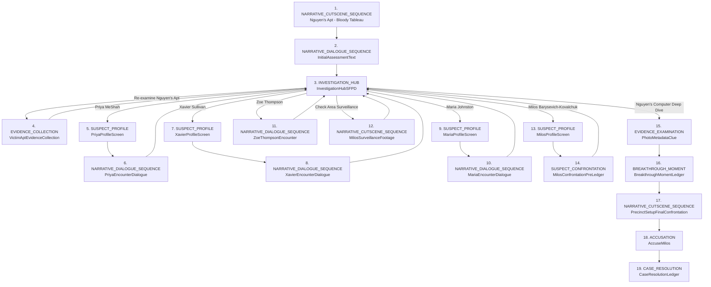
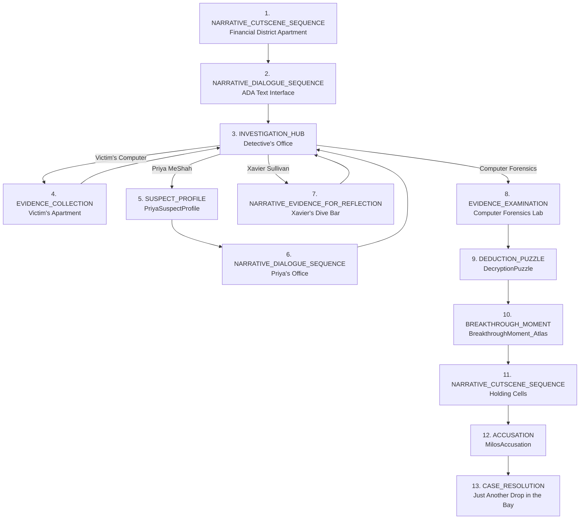
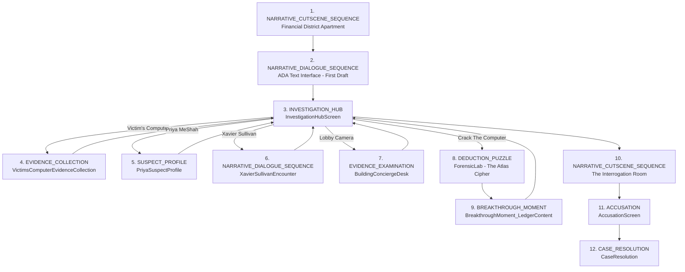
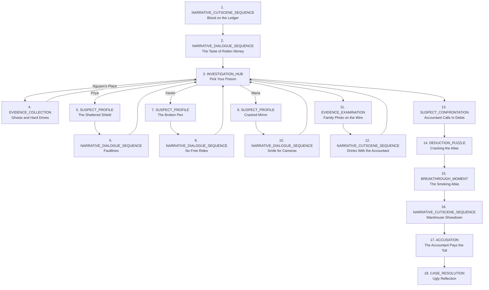

JOURNEY SAMPLES:

--- CLAUDE 4.0 OPUS---
Case: The Cartel's Coded Ledger
(Phase 1: The Gutter Opens Up)

NARRATIVE_CUTSCENE_SEQUENCE: Financial District Penthouse - Blood Money

DECISION: The scene hits you like a sledgehammer. What raw detail do you send to ADA Song first?
DATA:

SceneDescription: "(Cinematic Cutscene) Luxury apartment, but death don't discriminate. Tuan Nguyen, face down at his dinner table. Single bullet hole, professional work. His fancy dinner's gone cold. Computer screen glowing like a ghost in the corner. Air smells like expensive cologne mixed with gunpowder. City lights outside mock the darkness inside."
InitialPlayerObservationPrompts: ["The dinner's still warm. Killer didn't let him finish his last meal.", "Computer's still on. Whatever he was working on, it was worth dying for.", "No struggle. Either he knew the shooter or never saw it coming."]

OPTIONS:

Text ADA: "Financial District penthouse. Nguyen caught one at dinner. Still warm. Professional work." (Risk: "Too clinical?", Reward: "Sets professional tone.")
Text ADA: "Computer's still glowing. Whatever Nguyen was typing was worth a bullet." (Risk: "Speculative.", Reward: "Highlights key detail.")
Text ADA: "No signs of struggle. Nguyen either trusted his killer or was too surprised to fight." (Risk: "Assuming too much.", Reward: "Notes important observation.")

ACTION: NAVIGATE TO InitialMonologue

NARRATIVE_DIALOGUE_SEQUENCE: InitialMonologue - Reading the Room

DECISION: Give ADA the full picture. What's your gut telling you about this mess?
DATA:

SpeakingCharacter: "Player (Detective - via text to ADA)"
DialogueContent: ["Security consultant with a bullet in his head. In this city, that's either very bad luck or very bad business.", "Expensive apartment, expensive problems. This wasn't some street thug looking for a score.", "The way he's slumped, death came during the main course. Someone he was comfortable with."]
ADALastReply: "ADA: Just got your text. Security consultant? Those guys usually see trouble coming. What's the scene telling you?"

OPTIONS:

Text ADA: "This wasn't random, Song. Too clean, too quiet. Someone wanted Nguyen's secrets buried with him." (Risk: "Jumping ahead.", Reward: "Strong initial assessment.")
Text ADA: "High-end hit in a high-end place. Nguyen was playing in the deep end and drowned." (Risk: "Too metaphorical.", Reward: "Sets noir tone.")
Text ADA: "Professional execution, personal motive. That's the cocktail I'm tasting here." (Risk: "Contradictory?", Reward: "Captures complexity.")

ACTION: NAVIGATE TO DetectiveOfficeHub

(Phase 2: First Contacts & Rising Tension)

INVESTIGATION_HUB: DetectiveOfficeHub - Mapping the Maze

DECISION: The city's full of suspects when money and secrets collide. Where do you start digging? (Text ADA your next move)
CLUES/DATA:

CaseSummary: "Victim: Tuan Nguyen, security consultant. Single gunshot, professional execution. Computer still running. ADA Song awaits your next move."
Activities: [
{ Name: "Check Nguyen's apartment again - Dig deeper", TargetScreen: "ApartmentDeepDive", Phenotype: "EVIDENCE_COLLECTION" },
{ Name: "Priya MeShah - Corporate lawyer with money troubles", TargetScreen: "PriyaProfile", Phenotype: "SUSPECT_PROFILE" },
{ Name: "Xavier Sullivan - Journalist sniffing around", TargetScreen: "XavierProfile", Phenotype: "SUSPECT_PROFILE" },
{ Name: "Maria Johnston - Politician with secrets", TargetScreen: "MariaProfile", Phenotype: "SUSPECT_PROFILE" },
{ Name: "Milos Barysevich-Kovalchuk - 'Investment banker'", TargetScreen: "MilosProfile", Phenotype: "SUSPECT_PROFILE" }
]

OPTIONS:

Text ADA: "Going back to Nguyen's place. That computer's singing a song I need to hear." (Risk: "Crime scene contamination.", Reward: "Digital evidence awaits.")
Text ADA: "Time to shake the money tree. That lawyer MeShah had her fingers in Nguyen's pie." (Risk: "Lawyers talk circles.", Reward: "Follow the money.")
Text ADA: "Sullivan the journalist. Those types always know more than they print." (Risk: "Press protection.", Reward: "Information broker.")
Text ADA: "Barysevich-Kovalchuk. 'Investment banker' my ass. Smells like mob money." (Risk: "Dangerous if connected.", Reward: "Could be the big fish.")

ACTION: NAVIGATE TO <GET_TARGET_SCREEN_FROM_CHOICE(choice)>

SUSPECT_PROFILE: MilosProfile - The Accountant

DECISION: Milos Barysevich-Kovalchuk. That name's too long for an honest man. What strikes you about him to report to ADA?
CLUES/DATA:

SuspectInfo: "Milos Barysevich-Kovalchuk, 48. Claims he's an investment banker. Offices near Nguyen's building. Expensive suits that don't quite fit right, like he's wearing someone else's skin. Gold signet ring, Ukrainian crest. Eyes like a shark's - dead until they smell blood."
Statements: ["MB: 'Mr. Nguyen and I had... business discussions. Nothing more.'", "MB: 'I was at my office that evening. Working late. The markets, you understand.'"]
BehavioralObservationPrompts: ["Slight tic in his left eye when Nguyen's name comes up.", "Hands are soft but scarred. Desk job with a violent past.", "Smokes unfiltered cigarettes. Power play or just Old World habit?"]

OPTIONS:

Text ADA: "Milos has mob written all over him. That eye tic when I mention Nguyen is telling tales." (Risk: "Profiling.", Reward: "Trust your instincts.")
Text ADA: "Banker my ass. His hands tell a different story. This guy's done wet work." (Risk: "No proof.", Reward: "Experience talking.")
Text ADA: "Ukrainian mob maybe? That ring, the cigarettes, the dead eyes. Classic import." (Risk: "Stereotyping.", Reward: "Pattern recognition.")

ACTION: NAVIGATE TO DetectiveOfficeHub

EVIDENCE_COLLECTION: ApartmentDeepDive - Digital Graves

DECISION: Back at Nguyen's place. That computer's humming like it's got secrets. What catches your eye?
CLUES/DATA:

SceneDesc: "The apartment's quieter now. Death's had time to settle in. Computer's still on, cursor blinking like a pulse. Desktop's too clean - family photo, couple work files. But that hard drive light's been busy."
Hotspots: ["Check computer more carefully", "Examine family photo on desk", "Look at dinner table again"]
ComputerDetail: "Lot of unallocated space on this drive. Like someone's hiding a whole other world in there."
ADALastReply: "ADA: Forensics will want that computer. But your eyes see things theirs miss."

OPTIONS:

Text ADA: "Computer's got more empty space than a politician's promises. Hidden partition maybe." (Risk: "Technical speculation.", Reward: "Could unlock evidence.")
Text ADA: "Family photo on desktop looks tampered with. Metadata's all wrong." (Risk: "Grasping.", Reward: "Might be a key.")
Text ADA: "Hard drive's been working overtime. Whatever's hidden, it's big." (Risk: "Vague.", Reward: "Confirms suspicion.")

ACTION: NAVIGATE TO DetectiveOfficeHub

(Phase 3: Twisting Loyalties & Hidden Motives)

NARRATIVE_DIALOGUE_SEQUENCE: XavierEncounter - Press Pressure

DECISION: Sullivan's in his element at this dive bar. What part of your conversation do you report to ADA?
DATA:

SpeakingCharacter: "Xavier Sullivan / Player observations"
DialogueContent: ["XS: 'Nguyen was sitting on a powder keg. Cartel connections, government contracts. The whole stinking mess.'", "XS: 'I told him to give me the story, but he kept stalling. Said the timing wasn't right.'", "XS: 'Now he's dead and my story's dead with him. Unless...'"]
CharacterDescription: "Sullivan's got that hungry look. Cigarette burns on his knuckles, bourbon on his breath. A man running out of time and options."
ObservationPrompts: ["His hands shake when he lights up. Withdrawal or fear?", "Keeps checking his phone. Waiting for a call that won't come.", "Eyes dart to the door every time it opens."]

OPTIONS:

Text ADA: "Sullivan knew about cartel connections. Claims Nguyen was his source. Smells desperate." (Risk: "Taking his word.", Reward: "Confirms cartel angle.")
Text ADA: "The journalist's spooked. Not just about losing a story. He's scared of something." (Risk: "Paranoid reporter.", Reward: "There's more here.")
Text ADA: "Sullivan wanted that story bad. Bad enough to kill for it?" (Risk: "Weak motive.", Reward: "Consider all angles.")

ACTION: NAVIGATE TO DetectiveOfficeHub

EVIDENCE_EXAMINATION: FamilyPhotoAnalysis - Hidden Keys

DECISION: That family photo's been bugging you. Tech boys found something in the metadata. How do you explain it to ADA?
CLUES/DATA:

EvidenceItem: "Family photo from Nguyen's desktop. Embedded in metadata: partial encryption key. This wasn't just memories - it was a lockbox."
TechAnalysis: "Photo's got hidden data. Part of an encryption key. Smart bastard hid it in plain sight."
ADALastReply: "ADA: Encryption? Our security consultant was keeping secrets. From who?"

OPTIONS:

Text ADA: "Nguyen hid an encryption key in his family photo. Whatever he was protecting, it was personal." (Risk: "Still incomplete.", Reward: "Major clue.")
Text ADA: "Smart play. Hide the key where everyone can see it but no one would look." (Risk: "Admiring a dead man.", Reward: "Understanding the victim.")

ACTION: NAVIGATE TO DetectiveOfficeHub

NARRATIVE_CUTSCENE_SEQUENCE: CartelConnection - The Web Tightens

DECISION: A CI just tipped you about Blue Moon matches at the scene. That's cartel territory. What's your take for ADA?
DATA:

SceneDescription: "(Brief cutscene) Forensics found a Blue Moon matchbook under Nguyen's desk. That club's been a cartel front for years. The web's getting sticky."
Revelation: "The Blue Moon's where the cartel does its banking. If Nguyen had their matchbook..."
ADALastReply: "ADA: The Blue Moon? That's Sinaloa territory. What was our consultant consulting on?"

OPTIONS:

Text ADA: "Blue Moon matchbook at the scene. Nguyen was playing both sides of a very dangerous fence." (Risk: "Assumptions.", Reward: "Cartel confirmation.")
Text ADA: "Cartel calling card. Either Nguyen was in bed with them or investigating them." (Risk: "Binary thinking.", Reward: "Clear possibilities.")

ACTION: NAVIGATE TO SuspectConfrontationMilos

(Phase 4: The Long Drop)

SUSPECT_CONFRONTATION: SuspectConfrontationMilos - Pressure Point

DECISION: Time to squeeze Milos about the Blue Moon. How do you play it for ADA?
CLUES/DATA:

SuspectReaction: "Mentioned the Blue Moon to Milos. That eye tic went into overdrive. His accent got thicker. 'I know nothing of such places, Detective.'"
BodyLanguage: "He crushed his cigarette hard enough to split the filter. Hands went to that ring like a rosary."
ADALastReply: "ADA: Blue Moon's got him rattled. Push harder?"

OPTIONS:

Text ADA: "Milos just about swallowed his tongue at 'Blue Moon'. He's connected." (Risk: "He'll lawyer up.", Reward: "Confirms suspicion.")
Text ADA: "The accountant's mask is slipping. His tell's showing - this is our guy." (Risk: "Circumstantial.", Reward: "Gut instinct proven.")

ACTION: NAVIGATE TO BreakthroughDigitalLedger

BREAKTHROUGH_MOMENT: BreakthroughDigitalLedger - The Atlas Falls

DECISION: Forensics cracked it. The Atlas ledger. Names, numbers, and Nguyen's last message. How do you break it to ADA?
CLUES/DATA:

Revelation: "Atlas ledger decoded. Cartel financial network laid bare. Final entry: 'Accountant knows. Transferring data NOW. If I fail - Milos Barysevich-Kovalchuk is A.'"
ImpactAnalysis: "Nguyen was a government asset. Was about to blow the whole cartel operation. Milos is 'The Accountant'."
ADALastReply: "ADA: Tell me you've got something solid from that computer."

OPTIONS:

Text ADA: "Jackpot, Song. Nguyen was government. Has a whole cartel ledger. Last entry names Milos as the killer." (Risk: "None.", Reward: "Case-breaking evidence.")
Text ADA: "The Atlas ledger. Nguyen documented everything. Milos is 'The Accountant'. He killed to keep it quiet." (Risk: "None.", Reward: "Complete picture.")

ACTION: NAVIGATE TO FinalConfrontationSetup

(Phase 5: The Squeeze & The Spill)

NARRATIVE_CUTSCENE_SEQUENCE: FinalConfrontationSetup - All the Players

DECISION: Got them all in separate rooms. Time for the main event. How do you set the stage for ADA?
DATA:

SceneDescription: "(Omniscient cutscene) Precinct's buzzing. Milos in Room 1, sweating through his expensive shirt. MeShah's crying in Room 2. Sullivan's nursing a hangover in 3. Johnston's lawyer is raising hell in the lobby."
PlayerStrategy: "Time to play the recording of Nguyen's last entry."
ADALastReply: "ADA: The ledger's admissible. You've got him cold. Make it stick."

OPTIONS:

Text ADA: "Bringing Milos in for the show. His kingdom's about to crumble." (Risk: "He might crack violently.", Reward: "Psychological victory.")
Text ADA: "Time to introduce The Accountant to his final audit." (Risk: "Cocky.", Reward: "Confidence in evidence.")

ACTION: NAVIGATE TO MilosAccusation

ACCUSATION: MilosAccusation - The Accountant's Final Entry

DECISION: Milos heard the ledger entry. He's done. What final observation do you send ADA?
CLUES/DATA:

SuspectBreakdown: "Played Nguyen's last entry. Milos went gray. That tic became a tremor. Started in Ukrainian, then broken English. 'He was going to destroy everything...'"
ConfessionElements: "Admits to discovering Nguyen's identity. The meeting. The panic. The gun."
ADALastReply: "ADA: You've got him. Don't let him slip away."

OPTIONS:

Text ADA: "The Accountant's books are closed. Full confession. Murder one to protect the cartel." (Risk: "None.", Reward: "Case closed.")
Text ADA: "Milos cracked like cheap concrete. Admitted everything. Nguyen died for getting too close to the truth." (Risk: "None.", Reward: "Justice served.")

ACTION: NAVIGATE TO CaseResolution

CASE_RESOLUTION: CaseResolution - Ledgers and Lies

DECISION: Another corpse, another killer, another day in paradise. How do you sign off with ADA?
CLUES/DATA:

Resolution: "Milos Barysevich-Kovalchuk, life without parole. The Atlas ledger's with the Feds now. Cartel's scrambling."
Aftermath: "MeShah's disbarred but free. Sullivan got his story and a Pulitzer nomination. Johnston resigned 'for health reasons'."
ADALastReply: "ADA: Hell of a case, detective. A security consultant who was anything but. You did good."

OPTIONS:

Text ADA: "Nguyen died trying to do right. That's more than most get in this city." (Risk: null, Reward: "Respectful end.")
Text ADA: "The Accountant's in a cage, but there's always another one keeping books. See you at the next body, Song." (Risk: null, Reward: "Cynical truth.")

ACTION: END_CASE

mermaidCopygraph TD
    S1["1. NARRATIVE_CUTSCENE_SEQUENCE\nFinancial District Penthouse"] --> S2["2. NARRATIVE_DIALOGUE_SEQUENCE\nInitialMonologue"]
    S2 --> S3["3. INVESTIGATION_HUB\nDetectiveOfficeHub"]
    S3 --> S4["4. SUSPECT_PROFILE\nMilosProfile"]
    S4 --> S3
    S3 --> S5["5. EVIDENCE_COLLECTION\nApartmentDeepDive"]
    S5 --> S3
    S3 --> S6["6. NARRATIVE_DIALOGUE_SEQUENCE\nXavierEncounter"]
    S6 --> S3
    S3 --> S7["7. EVIDENCE_EXAMINATION\nFamilyPhotoAnalysis"]
    S7 --> S3
    S3 --> S8["8. NARRATIVE_CUTSCENE_SEQUENCE\nCartelConnection"]
    S8 --> S9["9. SUSPECT_CONFRONTATION\nSuspectConfrontationMilos"]
    S9 --> S10["10. BREAKTHROUGH_MOMENT\nBreakthroughDigitalLedger"]
    S10 --> S11["11. NARRATIVE_CUTSCENE_SEQUENCE\nFinalConfrontationSetup"]
    S11 --> S12["12. ACCUSATION\nMilosAccusation"]
    S12 --> S13["13. CASE_RESOLUTION\nCaseResolution"]Add to Conversation

    ---/opus---
---CLAUDE 4.0 SONNET---
Case: The Cartel's Coded Ledger
(Phase 1: The Gutter Opens Up)

NARRATIVE_CUTSCENE_SEQUENCE: Crime Scene - Financial District Luxury

DECISION: Tuan Nguyen's apartment. Blood on the hardwood, dinner getting cold. What hits you first to text ADA Song?
DATA:

SceneDescription: "(Cinematic) Luxury apartment, 34th floor. Nguyen face-down beside his dining table, takeout containers still warm. Single hole in his back, clean and professional. The city glitters beyond floor-to-ceiling windows like broken promises. Air thick with cordite and expensive cologne."
InitialPlayerObservationPrompts: ["Dinner's still warm, but Nguyen's stone cold. Killer moved fast.", "No struggle marks on the hardwood. He trusted whoever put him down.", "Smells like cordite and fear. Professional job, personal timing."]

OPTIONS:

Text ADA: "Nguyen's apartment. Dinner still steaming, but he's been cooling for a while. Clean shot, back of the head. Professional." (Risk: "Too clinical?", Reward: "Sets the execution tone for ADA.")
Text ADA: "Financial District high-rise. Nguyen ate his last meal in style. Killer didn't even let him finish." (Risk: "Missing key details.", Reward: "Emphasizes the cold timing to ADA.")
Text ADA: "No signs of struggle, Song. Nguyen knew his killer or never saw them coming. This wasn't random." (Risk: "Jumping ahead.", Reward: "Highlights trust betrayal angle.")

ACTION: NAVIGATE TO InitialAssessment

NARRATIVE_DIALOGUE_SEQUENCE: InitialAssessment - The Real Picture

DECISION: Give ADA the full picture. This whole scene stinks of something bigger than a simple hit.
DATA:

SpeakingCharacter: "Player (Detective Singh - via text to ADA)"
DialogueContent: ["This wasn't a robbery gone wrong. Too clean, too quiet. Someone wanted Nguyen silenced, not robbed.", "The way he's positioned, he was eating when it happened. Killer walked right up behind him. That's trust or stupidity.", "High-end apartment, expensive taste, but this feels like business. Cold, calculated business."]
ADALastReply: "ADA: Financial District, high-rise. Nguyen had money and enemies. What's your gut telling you, Singh?"

OPTIONS:

Text ADA: "This was an execution, not a murder. Someone wanted Nguyen quiet forever. The question is what he knew." (Risk: "Speculation.", Reward: "Sets investigation focus for ADA.")
Text ADA: "Killer had access, timing, and skill. Either Nguyen let them in or they had keys. Professional all the way." (Risk: "Stating obvious.", Reward: "Emphasizes inside job angle.")
Text ADA: "The apartment screams money, but the murder whispers secrets. Nguyen was sitting on something worth killing for." (Risk: "Too poetic.", Reward: "Establishes motive framework with ADA.")

ACTION: NAVIGATE TO InvestigationHub

(Phase 2: First Contacts & Rising Tension)

INVESTIGATION_HUB: InvestigationHub - Detective's Office

DECISION: The city's full of suspects with means and motive. Which thread do you pull first? Text ADA your move.
CLUES/DATA:

CaseSummary: "Victim: Tuan Nguyen, Financial District apartment. Professional execution during dinner. ADA Song is tracking the case file. Multiple suspects with financial and political ties to victim."
Activities: [
{ Name: "Examine Nguyen's Computer - His Digital Life", TargetScreen: "ComputerEvidence", Phenotype: "EVIDENCE_COLLECTION" },
{ Name: "Interview Zoe Thompson - Building Concierge", TargetScreen: "ZoeWitness", Phenotype: "SUSPECT_PROFILE" },
{ Name: "Check Milos Barysevich-Kovalchuk - Business Associate", TargetScreen: "MilosSuspect", Phenotype: "SUSPECT_PROFILE" },
{ Name: "Press Priya MeShah - Lawyer with Grudge", TargetScreen: "PriyaSuspect", Phenotype: "SUSPECT_PROFILE" }
]

OPTIONS:

Text ADA: "Nguyen's computer first. Dead men's digital ghosts tell the best stories." (Risk: "Might be encrypted.", Reward: "Tech guys love a challenge.")
Text ADA: "Building concierge, Zoe Thompson. She sees everything, remembers nothing. Time to jog her memory." (Risk: "Civilian nerves.", Reward: "Eye witness beats speculation.")
Text ADA: "That business associate, Milos. Too slick, too convenient. Checking his alibi." (Risk: "Might tip him off.", Reward: "Gut feelings pay bills.")
Text ADA: "The lawyer, MeShah. Recent beef with Nguyen over money. Money makes people desperate." (Risk: "Lawyers are careful.", Reward: "Follow the money, find the motive.")

ACTION: NAVIGATE TO <GET_TARGET_SCREEN_FROM_CHOICE(choice)>

EVIDENCE_COLLECTION: ComputerEvidence - Digital Secrets

DECISION: Nguyen's computer. Looks clean on the surface, but the tech boys found something. What detail about the hidden data catches your eye to text ADA?
CLUES/DATA:

SceneDesc: "Nguyen's home office. High-end setup, multiple monitors. Computer's been wiped, but not completely. Forensics found a hidden partition - encrypted tight as a bank vault."
Hotspots: ["Examine Hidden Partition", "Check Recent File Access", "Review Email History"]
HiddenPartitionDetail: "Massive encrypted file labeled 'Atlas'. Timestamp shows activity minutes before estimated time of death. Whatever's in here, Nguyen was working on it when he died."
ADALastReply: "ADA: Tech boys are good. If they found something hidden, it was meant to stay that way. What's the story?"

OPTIONS:

Text ADA: "Found a hidden partition. File called 'Atlas' - active minutes before he died. This is what got him killed." (Risk: "Can't crack encryption yet.", Reward: "Confirms motive timing for ADA.")
Text ADA: "Computer's been scrubbed, but not by Nguyen. Someone tried to clean house after the murder." (Risk: "Assumes killer knowledge.", Reward: "Suggests killer computer skills.")
Text ADA: "Whatever Nguyen was hiding, he was updating it when the killer arrived. Bad timing or perfect timing." (Risk: "Speculation.", Reward: "Emphasizes urgency element to ADA.")

ACTION: NAVIGATE TO ZoeWitness

(Phase 3: Twisting Loyalties & Hidden Motives)

SUSPECT_PROFILE: ZoeWitness - The Eyes That See

DECISION: Zoe Thompson, building concierge. Nervous as a cat in a thunderstorm. What tells you she knows more than she's saying?
CLUES/DATA:

SuspectInfo: "Zoe Thompson, 29, building concierge. On duty night of murder. Claims she saw 'someone suspicious' but description is vague. Keeps wringing her hands, won't meet eyes directly. Working double shifts - needs the money."
Statements: ["ZT: 'I saw someone, but the lighting was bad. Could've been anyone.'", "ZT: 'I was on break when... when it happened. Just bad timing.'"]
BehavioralObservationPrompts: ["She keeps glancing at the security monitor. Like she's afraid it'll talk.", "Her hands shake when she mentions the 'break'. More to that story.", "She's poor, overworked. Someone might've paid her to look the other way."]

OPTIONS:

Text ADA: "Zoe's lying about something. Won't look at the security monitor, hands shaking. Someone got to her." (Risk: "Might scare her more.", Reward: "Confirms witness tampering angle.")
Text ADA: "She was on break during the murder. Convenient timing or bought timing? Girl needs money." (Risk: "Assuming corruption.", Reward: "Highlights financial pressure motive.")
Text ADA: "Thompson saw someone but won't say who. Fear or payment keeping her quiet." (Risk: "Might be genuine trauma.", Reward: "Focuses on witness reliability issue.")

ACTION: NAVIGATE TO MilosSuspect

SUSPECT_PROFILE: MilosSuspect - The Accountant

DECISION: Milos Barysevich-Kovalchuk. All expensive suits and cold eyes. Something about his story doesn't add up. What detail makes your skin crawl to text ADA?
CLUES/DATA:

SuspectInfo: "Milos Barysevich-Kovalchuk, 48, investment banker. Ukrainian accent, gold signet ring, unfiltered cigarettes. Claims business relationship with Nguyen was 'purely professional'. Office two blocks from victim's building. Alibi involves 'working late alone'."
Statements: ["MB: 'Mr. Nguyen and I conducted legitimate business. Nothing more.'", "MB: 'I was reviewing financial reports in my office. No witnesses, unfortunately.'"]
BehavioralObservationPrompts: ["His hands are calloused despite the desk job. Manual labor or violence?", "When I mentioned Nguyen's computer files, his eye twitched. Just once.", "Smells like expensive cologne and cheap cigarettes. Trying to cover something up."]

OPTIONS:

Text ADA: "Milos has working man's hands in a banker's suit. Either he's got hobbies or a darker profession." (Risk: "Circumstantial.", Reward: "Highlights physical inconsistency to ADA.")
Text ADA: "Mentioned Nguyen's computer and Milos flinched. Knows more about digital files than he's saying." (Risk: "Subtle tell.", Reward: "Connects to computer evidence.")
Text ADA: "No alibi, office near victim's building, and those cold eyes. This one's got killer written all over him." (Risk: "Too obvious?", Reward: "Strong suspect for ADA to track.")

ACTION: NAVIGATE TO EncryptionBreakthrough

(Phase 4: The Long Drop)

EVIDENCE_EXAMINATION: EncryptionBreakthrough - Digital Confession

DECISION: Tech boys cracked the encryption. The 'Atlas' file... it's a ledger. Cartel finances, code names, and a final entry that changes everything. How do you break this to ADA?
CLUES/DATA:

EvidenceItem: "Decrypted 'Atlas' ledger contains detailed cartel financial operations, code names for operatives including 'The Accountant', and final entry timestamped at time of murder: 'Accountant knows. Transferring data NOW. If I fail - Milos Barysevich-Kovalchuk is A.'"
ADALastReply: "ADA: Those encryption keys better be worth the wait. What's the smoking gun?"
RevealedConnections: "Nguyen was intelligence source. Milos is 'The Accountant'. Victim was about to expose entire operation."

OPTIONS:

Text ADA: "The Atlas file. Nguyen was a fed, Milos is 'The Accountant'. Last entry names Milos as his killer. Written as he died." (Risk: "None. This is gold.", Reward: "Case-breaking evidence for ADA.")
Text ADA: "Cartel ledger, Song. Financial network, code names, the works. Nguyen was intelligence, Milos killed him to stay hidden." (Risk: "Overwhelming info.", Reward: "Full context for ADA.")
Text ADA: "Found Nguyen's smoking gun. He was a spy, Milos is cartel money man. Final entry identifies his own killer." (Risk: "Sounds like fiction.", Reward: "Dramatic reveal to ADA.")

ACTION: NAVIGATE TO MilosConfrontation

SUSPECT_CONFRONTATION: MilosConfrontation - The Mask Drops

DECISION: Confronting Milos with the ledger evidence. He knows we have him, but he's still playing games. What breaks through his facade to text ADA?
CLUES/DATA:

SuspectBehavior: "Showed Milos the ledger entry. His face went pale, then cold as winter steel. Started speaking in clipped sentences, accent thicker. Gold ring glinting as his hands clenched. Still denying, but sweat's beading on his forehead."
ADALastReply: "ADA: Digital evidence doesn't lie. Press him on the timeline, the access, the motive. Make him crack."
KeyAccusationPoints: ["Confront him about 'The Accountant' identity", "Press him on building access and timing", "Challenge his knowledge of Nguyen's intelligence work"]

OPTIONS:

Text ADA: "Called him 'The Accountant' and he stopped breathing for a second. Got him, Song. He knows we know." (Risk: "Might lawyer up.", Reward: "Confirms identity connection.")
Text ADA: "He's sweating now, speaking in that thick accent. The smooth banker act is cracking under pressure." (Risk: "Still denying.", Reward: "Shows guilty behavior to ADA.")
Text ADA: "Milos knows about the ledger, the timing, everything. He's guilty as sin and twice as cold." (Risk: "No confession yet.", Reward: "Builds case confidence with ADA.")

ACTION: NAVIGATE TO FinalConfrontation

(Phase 5: The Squeeze & The Spill)

NARRATIVE_CUTSCENE_SEQUENCE: FinalConfrontation - All Cards on the Table

DECISION: Got all the suspects in separate rooms, but Milos is the only one sweating. Time for the formal accusation. How do you set the stage with ADA?
DATA:

SceneDescription: "(Omniscient view) Precinct buzzing with activity. Milos in main interrogation room, lawyer on the way. Priya MeShah pacing in holding, Xavier Sullivan chain-smoking in another room, Maria Johnston making calls about damage control. The ledger evidence spread across Singh's desk like a roadmap to hell."
PlayerDetectiveInternalThought: "All the pieces fit. Time to end this."
ADALastReply: "ADA: You've got motive, means, opportunity, and a digital confession. Slam dunk, Singh. Bring him down."

OPTIONS:

Text ADA: "Milos is cornered. Digital evidence, witness placement, everything points to him. Time for the final play." (Risk: "Lawyer arriving soon.", Reward: "Clean prosecution case.")
Text ADA: "The ledger, the timing, the access. Milos killed Nguyen to protect his cartel identity. Case closed." (Risk: "Overconfident?", Reward: "Strong conviction confidence for ADA.")

ACTION: NAVIGATE TO FormalAccusation

ACCUSATION: FormalAccusation - Justice Served Cold

DECISION: This is it. Formal accusation. Milos Barysevich-Kovalchuk, aka 'The Accountant', for the murder of Tuan Nguyen. How do you deliver the final word to ADA?
CLUES/DATA:

AccusationEvidence: "Digital ledger naming Milos as 'The Accountant', final entry identifying him as killer, security footage placing him at scene, financial records linking him to cartel operations, motive of preventing exposure of intelligence operation."
ADALastReply: "ADA: Make it official, Singh. The evidence speaks for itself."
MilosReaction: "Milos finally broke when presented with Nguyen's final entry. Confessed to killing him to prevent cartel exposure. Claimed it was 'necessary business'."

OPTIONS:

Text ADA: "Milos Barysevich-Kovalchuk, you're under arrest for the murder of Tuan Nguyen. The ledger doesn't lie, and neither do dead men." (Risk: null, Reward: "Justice delivered.")
Text ADA: "Got him, Song. 'The Accountant' finally balanced his books. Nguyen's last entry sealed his killer's fate." (Risk: null, Reward: "Poetic justice for ADA.")

ACTION: NAVIGATE TO CaseResolution

CASE_RESOLUTION: CaseResolution - The City Keeps Turning

DECISION: Milos confessed, case closed. The cartel lost their accountant, but there's always another one. How do you sign off with ADA?
CLUES/DATA:

ConclusionSummary: "Milos Barysevich-Kovalchuk confessed to murdering Tuan Nguyen to prevent exposure of cartel financial operations. Nguyen's intelligence work threatened the entire network. Justice served, but the cartel machine keeps grinding."
CharacterFates: "Priya MeShah cleared but reputation damaged. Xavier Sullivan got his story after all. Maria Johnston spinning political damage control. Zoe Thompson still jumpy but relieved. The city's Financial District pretends nothing happened."
ADALastReply: "ADA: Another killer off the streets, Singh. The cartel will find a new accountant, but at least Nguyen got his justice."

OPTIONS:

Text ADA: "Case closed, Song. Milos goes down for Nguyen's murder. The cartel's books are a little messier now." (Risk: null, Reward: null)
Text ADA: "Justice for Nguyen, another predator caged. The Financial District can sleep easier tonight. Time for that bourbon." (Risk: null, Reward: null)

ACTION: END_CASE

mermaidCopygraph TD
    S1["1. NARRATIVE_CUTSCENE_SEQUENCE\nCrime Scene - Financial District"] --> S2["2. NARRATIVE_DIALOGUE_SEQUENCE\nInitialAssessment"]
    S2 --> S3["3. INVESTIGATION_HUB\nInvestigationHub"]
    S3 -- "Computer Evidence" --> S4["4. EVIDENCE_COLLECTION\nComputerEvidence"]
    S3 -- "Zoe Witness" --> S5["5. SUSPECT_PROFILE\nZoeWitness"]
    S3 -- "Milos Suspect" --> S6["6. SUSPECT_PROFILE\nMilosSuspect"]
    S4 --> S5
    S5 --> S6
    S6 --> S7["7. EVIDENCE_EXAMINATION\nEncryptionBreakthrough"]
    S7 --> S8["8. SUSPECT_CONFRONTATION\nMilosConfrontation"]
    S8 --> S9["9. NARRATIVE_CUTSCENE_SEQUENCE\nFinalConfrontation"]
    S9 --> S10["10. ACCUSATION\nFormalAccusation"]
    S10 --> S11["11. CASE_RESOLUTION\nCaseResolution"]
---sonnet---
---gemini 2.5 pro---

**Case:** The Cartel's Coded Ledger
**Goal:** Player, as Detective Ajay Singh, texts observations and deductions to their partner, ADA Song, to uncover Milos Barysevich-Kovalchuk as Tuan Nguyen's murderer. The journey emphasizes gritty atmosphere, implicit clue discovery through observation, and loaded interactions.

**(Phase 1: The Gutter Opens Up)**

1.  **NARRATIVE_CUTSCENE_SEQUENCE: Nguyen's Apartment - The Bloody Tableau**
    *   **DECISION:** The scene hits you like a fist. Financial district opulence, but death makes every place cheap. What's the first raw detail you send to ADA Song?
    *   **DATA:**
        - SceneDescription: "(Cinematic Cutscene) Tuan Nguyen, 52, face down at his dining table. A single gunshot wound, execution-style. Spilled wine pools like blood on the polished mahogany. The room is cold, sterile, despite the carnage. His high-end computer on a nearby desk is dark, screen wiped clean, but the tower hums faintly."
        - InitialPlayerObservationPrompts: ["The silence in here is heavy. Paid for in lead.", "Nguyen's dinner still on the table. Interrupted by a guest he didn't expect to stay long.", "Computer screen's blank, wiped. But the tower's still warm. Someone was in a hurry."]
    *   **OPTIONS:**
        - Text ADA: "Nguyen, Financial District. Execution. One shot. Expensive suit, cheap end." (Risk: "Too blunt for a start?", Reward: "Sets the cold tone.")
        - Text ADA: "At Nguyen's. Dinner for one, looks like. Except for the uninvited guest with the silencer. Place is too tidy for a struggle." (Risk: "Assuming silencer.", Reward: "Highlights the professional nature.")
        - Text ADA: "Victim's Tuan Nguyen. His computer's wiped, but still warm. Killer was after more than his life, searched the tech." (Risk: "Jumping to digital motive.", Reward: "Focuses ADA on the computer early.")
    *   **ACTION:** `NAVIGATE TO InitialAssessmentText`

2.  **NARRATIVE_DIALOGUE_SEQUENCE: InitialAssessmentText - First Read to Song**
    *   **DECISION:** Sum up this charnel house for ADA. Your gut feeling, raw and unfiltered.
    *   **DATA:**
        - SpeakingCharacter: "Player (Detective Ajay Singh - via text to ADA)"
        - DialogueContentOptions: ["This wasn't random, Song. This was a message. Nguyen knew something, or someone, he shouldn't have.", "The killer was a ghost. Clean entry, clean exit. Professional, cold. But there's a stink of panic under it all.", "Financial district wolves play for keeps. Nguyen got caught in the jaws of something big."]
        - ADALastReply: "ADA: Singh. Got your first text. Grim. What's your instinct telling you about this one?"
    *   **OPTIONS:**
        - Text ADA: "Song, this screams professional. One neat hole. But why wipe the computer? Nguyen wasn't just a suit. He was a secret." (Risk: "Too much speculation upfront.", Reward: "Plants the seed of a deeper conspiracy for ADA.")
        - Text ADA: "No forced entry. Nguyen knew his killer, or they had a key. The room's cold, like the bastard who did this. He was looking for something on that computer." (Risk: "Stating the obvious about no forced entry.", Reward: "Reinforces computer as central.")
        - Text ADA: "This feels like cartel work, but too high-class for the usual brutes. Polished, like the killer wore a tie to match the victim's." (Risk: "Early call on cartel.", Reward: "Introduces a powerful potential adversary to ADA.")
    *   **ACTION:** `NAVIGATE TO InvestigationHubSFPD`

**(Phase 2: First Contacts & Rising Tension)**

3.  **INVESTIGATION_HUB: InvestigationHubSFPD - Your Desk, SFPD**
    *   **DECISION:** The city's a damn oyster, and Nguyen was a pearl someone wanted pried loose. Where do you apply the knife first? (Text ADA your next move).
    *   **CLUES/DATA:**
        - CaseSummary: "Victim: Tuan Nguyen, security consultant, executed. Computer wiped. Professional hit vibes. ADA Song is waiting for your plan of attack."
        - Activities: [
            { Name: "Re-examine Nguyen's Apartment (Search for micro-clues)", TargetScreen: "VictimAptEvidenceCollection", Phenotype: "EVIDENCE_COLLECTION" },
            { Name: "Priya MeShah - The Lawyer (Handled Nguyen's offshore accounts)", TargetScreen: "PriyaProfileScreen", Phenotype: "SUSPECT_PROFILE" },
            { Name: "Xavier Sullivan - The Journalist (Was pressuring Nguyen for a story)", TargetScreen: "XavierProfileScreen", Phenotype: "SUSPECT_PROFILE" },
            { Name: "Maria Johnston - The Politician (Campaign allegedly took illicit funds Nguyen knew about)", TargetScreen: "MariaProfileScreen", Phenotype: "SUSPECT_PROFILE" },
            { Name: "Zoe Thompson - Building Concierge (Witness on duty)", TargetScreen: "ZoeThompsonEncounter", Phenotype: "NARRATIVE_DIALOGUE_SEQUENCE" }
            ]
        - ADALastReply: "ADA: Right. This needs a wide net at first. Who are we leaning on, Singh?"
    *   **OPTIONS:**
        - Text ADA: "Going back to Nguyen's. The devil's in the details, and this scene felt too clean. Looking for what the killer missed." (Risk: "Scene might be picked over.", Reward: "Fresh eyes might catch something.")
        - Text ADA: "Priya MeShah. Lawyer with offshore connections to Nguyen. Money always sings the loudest dirge." (Risk: "Lawyers are tight-lipped.", Reward: "Follow the money.")
        - Text ADA: "That reporter, Sullivan. Nosy type. Maybe Nguyen told him something that got him killed." (Risk: "Journalists protect sources, even dead ones.", Reward: "Might know the 'why'.")
        - Text ADA: "Politico Johnston. Rumors of dirty money Nguyen could trace. Power's a strong motive for murder." (Risk: "She'll have walls of PR.", Reward: "High profile, high stakes.")
        - Text ADA: "The concierge, Zoe Thompson. She was on duty. Might've seen a ghost a C-note could help her remember." (Risk: "Civilian witness, might be scared.", Reward: "Eyes on the ground.")
    *   **ACTION:** `NAVIGATE TO <GET_TARGET_SCREEN_FROM_CHOICE(choice)>`

4.  **EVIDENCE_COLLECTION: VictimAptEvidenceCollection - Nguyen's Apartment, Second Look**
    *   **DECISION:** Back in the dead man's apartment. The silence is thicker now. What almost invisible detail do you text ADA?
    *   **CLUES/DATA:**
        - SceneDesc: "The gloss of the initial scene has worn off. Now it’s just cold. Closer look… a single 9mm shell casing half under the dining table. Faint scent of industrial cleaner near the computer desk. And a subtle, almost imperceptible trace of saltwater on the balcony door handle."
        - Hotspots: ["Under Dining Table", "Computer Desk Area", "Balcony Door Handle", "Desktop - Misplaced Photo"]
        - ADALastReply: "ADA: Good. A second pass often turns up what the first sweep misses. What's catching your eye?"
    *   **OPTIONS:**
        - Text ADA: "Found it. Single 9mm casing under the table. Clean shot, professional ammo." (Risk: "Confirms initial but not new.", Reward: "Hard ballistics detail for ADA.")
        - Text ADA: "Near the computer, faint smell of heavy-duty cleaner. Not something Nguyen would use. And a trace of salt on the balcony door handle. Odd." (Risk: "Might be nothing.", Reward: "Points to cleanup and unusual trace for ADA.")
        - Text ADA: "There's a photo on his desk. Family shot. But it's crooked, like it was handled recently, and hastily. Doesn't fit the otherwise meticulous desktop." (Risk: "Just a messy desk?", Reward: "Highlights an anomaly for ADA.")
    *   **ACTION:** `NAVIGATE TO InvestigationHubSFPD`

5.  **SUSPECT_PROFILE: PriyaProfileScreen - The Corporate Lawyer**
    *   **DECISION:** Priya MeShah. Sharp suit, sharper eyes. Dossier says she had a heated dispute with Nguyen over shady transactions. What's your initial text to ADA before you meet her?
    *   **CLUES/DATA:**
        - SuspectInfo: { Name: "Priya MeShah", Description: "High-powered lawyer, 38. Impeccable, almost armored appearance. Voice like cut glass. Stood to lose millions if Nguyen's ledger exposed her.", MotiveHunch: "Financial ruin is a hell of a motivator.", DialogueStyle: "Precise, defensive, possibly brittle under pressure.", InitialStatement: "Claims relationship with Nguyen was 'strictly professional' and dispute was 'a standard disagreement'."}
        - ADALastReply: "ADA: Priya MeShah. Money trail often leads to the motive. What's the file say? What's your angle?"
    *   **OPTIONS:**
        - Text ADA: "MeShah. File screams 'financial motive.' Says she and Nguyen were arguing about big money. Going in expecting ice." (Risk: "Preconceptions can blind.", Reward: "Sets expectation for ADA.")
        - Text ADA: "Priya MeShah. All tailored suits and dollar signs. If Nguyen was about to burn her, she had reason to douse the fire." (Risk: "Figurative.", Reward: "Paints a vivid picture for ADA.")
    *   **ACTION:** `NAVIGATE TO PriyaEncounterDialogue`

6.  **NARRATIVE_DIALOGUE_SEQUENCE: PriyaEncounterDialogue - Priya MeShah's Office**
    *   **DECISION:** MeShah's office is colder than a morgue slab. She’s all professional composure, but something’s off. What observation about her denial or demeanor do you text ADA?
    *   **DATA:**
        - SpeakingCharacter: "Priya MeShah / Player (Detective Singh - internal thought or text to ADA)"
        - DialogueContent: "MeShah: 'Mr. Nguyen's death is a tragedy. Our disagreement was... vigorous, but hardly motive for... this.' Her hand trembles slightly as she sips water. 'I was working late. Alone.'"
        - CharacterDescription: "Priya MeShah. Looks like she hasn't slept in days. Designer suit, but her eyes are haunted. That tremor in her hand when she mentioned Nguyen's name..."
        - ADALastReply: "ADA: See if her composure cracks. Look for the fear."
    *   **OPTIONS:**
        - Text ADA: "MeShah claims she was 'working late.' Alone. Convenient. Hand trembled when she said Nguyen's name. Not as cool as she looks." (Risk: "Nerves aren't guilt.", Reward: "Notes a physical tell for ADA.")
        - Text ADA: "Priya's office is an ice palace. She calls their fight 'vigorous.' Understatement of the year, I bet. Says she has nothing to hide, but her eyes say different." (Risk: "Subjective read.", Reward: "Conveys Singh's gut feeling to ADA.")
        - Text ADA: "She kept adjusting a framed photo on her desk. Not Nguyen. Looked like family. A reminder of what she stood to lose?" (Risk: "Reaching for symbolism.", Reward: "Observes a potential personal pressure point for ADA.")
    *   **ACTION:** `NAVIGATE TO InvestigationHubSFPD`

7.  **SUSPECT_PROFILE: XavierProfileScreen - The Investigative Journalist**
    *   **DECISION:** Xavier Sullivan. Smells of stale coffee and desperation. History of exposing corruption, was leaning hard on Nguyen for a story. Your initial text to ADA?
    *   **CLUES/DATA:**
        - SuspectInfo: { Name: "Xavier Sullivan", Description: "Investigative journalist, 45. Rumpled suit, cynical eyes. Known for risky moves to get a scoop.", MotiveHunch: "Maybe Nguyen wouldn't give up the story, or was giving it to someone else.", DialogueStyle: "Fast-talking, impatient, likes to be the smartest guy in the room.", InitialStatement: "Claims he was at a public lecture across town, but admits he 'stepped out for air' for about 45 minutes."}
        - ADALastReply: "ADA: Sullivan. A journalist. They're always chasing something. What's his angle on Nguyen?"
    *   **OPTIONS:**
        - Text ADA: "Sullivan. Journalist. Dossier says he was hounding Nguyen. And his alibi for murder night has a 45-minute hole. Curious." (Risk: "Alibi holes are common.", Reward: "Highlights opportunity for ADA.")
        - Text ADA: "This Sullivan sounds like a hyena sniffing a kill. If Nguyen had a big story, Sullivan would want it first, or want him quiet if he couldn't get it." (Risk: "Assuming worst motives.", Reward: "Paints a picture of journalistic hunger to ADA.")
    *   **ACTION:** `NAVIGATE TO XavierEncounterDialogue`

8.  **NARRATIVE_DIALOGUE_SEQUENCE: XavierEncounterDialogue - Sullivan's Cluttered Apartment**
    *   **DECISION:** Sullivan's place is a mess of notes and nicotine. He’s wired, talking a mile a minute about conspiracies. What key quote or observation do you send ADA?
    *   **DATA:**
        - SpeakingCharacter: "Xavier Sullivan / Player (Detective Singh)"
        - DialogueContent: "Sullivan: 'Nguyen? He was onto something huge, man! Cartel big. I told him he was playing with fire. He was spooked, said he had an 'ace up his sleeve'.' His eyes are bloodshot, but keen. 'My lecture alibi? Solid. Mostly.'"
        - CharacterDescription: "Xavier Sullivan. Looks like he mainlines caffeine and outrage. His apartment is an explosion of research and paranoia. He's not lying about Nguyen being onto something big, though."
        - ADALastReply: "ADA: Journalists can be useful. Or just noisy. See if he knows what specific fire Nguyen was playing with."
    *   **OPTIONS:**
        - Text ADA: "Sullivan says Nguyen was onto 'cartel big' and had an 'ace up his sleeve.' Sounds like our victim was dealing from a dangerous deck. Sullivan's alibi is 'mostly solid.' Not reassuring." (Risk: "Sullivan could be exaggerating for effect.", Reward: "Confirms victim's dangerous path and shaky alibi for ADA.")
        - Text ADA: "This reporter, Sullivan. He's a live wire. Claims Nguyen was scared but had a plan. The way Sullivan avoids eye contact when he talks about his alibi... he's hiding something." (Risk: "Might just be his personality.", Reward: "Focuses ADA on Sullivan's potential deception.")
        - Text ADA: "Sullivan's apartment stinks of fear and ambition. He mentioned Nguyen was meeting someone 'high up' from the 'Accountant's' organization. That a name you know?" (Risk: "Second-hand info.", Reward: "First mention of 'Accountant' to ADA.")
    *   **ACTION:** `NAVIGATE TO InvestigationHubSFPD`

9.  **SUSPECT_PROFILE: MariaProfileScreen - The Prominent Politician**
    *   **DECISION:** Supervisor Maria Johnston. Polished, powerful, and allegedly tied to illicit funds Nguyen could expose. What’s your pre-meet text to ADA?
    *   **CLUES/DATA:**
        - SuspectInfo: { Name: "Maria Johnston", Description: "Bay Area Politician, 61. Commanding presence, iron smile. Faced career ruin if Nguyen’s ledger revealed her campaign’s dirty laundry.", MotiveHunch: "Protecting a political dynasty.", DialogueStyle: "Smooth, practiced, deflects with political jargon.", InitialStatement: "Claims she was at a private campaign dinner, left early citing illness, 'several people can confirm'."}
        - ADALastReply: "ADA: Maria Johnston. Politics is a dirty game. What kind of dirt did Nguyen have on her?"
    *   **OPTIONS:**
        - Text ADA: "Johnston. Politico with skeletons in her campaign closet. Nguyen supposedly had the key. Her alibi is a 'private dinner' she left early. Conveniently ill." (Risk: "Politicians have enemies, not always murderers.", Reward: "Highlights motive and questionable alibi for ADA.")
        - Text ADA: "Supervisor Johnston. If Nguyen was about to air her dirty campaign financing, silencing him would be 'civic duty' in her book, I bet." (Risk: "Cynical assumption.", Reward: "Conveys Singh's hardboiled view to ADA.")
    *   **ACTION:** `NAVIGATE TO MariaEncounterDialogue`

10. **NARRATIVE_DIALOGUE_SEQUENCE: MariaEncounterDialogue - Johnston's Campaign HQ**
     *   **DECISION:** Johnston’s HQ is all flags and fake smiles. She’s smooth, almost too smooth, dismissing Nguyen as a "troubled man." What tells ADA she’s rattled under that power suit?
     *   **DATA:**
         - SpeakingCharacter: "Maria Johnston / Player (Detective Singh)"
         - DialogueContent: "Johnston: 'Mr. Nguyen? A tragic loss. But his claims about my campaign were baseless, the product of a… stressed mind. My early departure from the dinner? A fleeting indisposition, nothing more.'" She taps a perfectly manicured finger on her desk, a little too rhythmically.
         - CharacterDescription: "Maria Johnston. Every hair in place, every word calculated. But her eyes have the glint of a cornered animal. That finger tap... it's like a trapped bird's wing."
         - ADALastReply: "ADA: Politicians are masters of deflection. Look for what she *isn't* saying. Any cracks in the facade?"
     *   **OPTIONS:**
         - Text ADA: "Johnston calls Nguyen 'stressed.' Rich, coming from her. Denies everything, but that finger-tapping on her desk was a Morse code of pure nerves." (Risk: "Could be impatience.", Reward: "Notes a nervous tic for ADA.")
         - Text ADA: "The Supervisor is all polish, but when I mentioned 'financial irregularities,' her smile tightened. Said her alibi is solid. We'll see. She’s hiding something behind that political armor." (Risk: "Standard political defensiveness.", Reward: "Highlights a specific reaction to ADA.")
         - Text ADA: "Johnston's office feels like a stage. She’s giving a performance. Mentioned Nguyen was getting 'reckless.' Like she knew more about his state of mind than she lets on." (Risk: "Her opinion, not fact.", Reward: "Suggests deeper knowledge to ADA.")
     *   **ACTION:** `NAVIGATE TO InvestigationHubSFPD`

**(Phase 3: Twisting Loyalties & Hidden Motives)**

11. **NARRATIVE_DIALOGUE_SEQUENCE: ZoeThompsonEncounter - Building Lobby, Concierge Desk**
     *   **DECISION:** Zoe Thompson, the concierge. Young, looks like she's seen a ghost and it asked for directions. Her initial statement was vague. What critical detail about the "suspicious person" or her demeanor do you text to ADA?
     *   **DATA:**
         - SpeakingCharacter: "Zoe Thompson / Player (Detective Singh)"
         - DialogueContent: "Zoe: 'That night... I took my break, like always. When I came back, I saw the footage later... someone, a man, well-dressed, expensive-looking watch, he slipped in. Didn't use the main entrance buzz. Used a keyfob. He seemed… deliberate. Kept his head down. I saw him leave later too, hat pulled low.'" Her voice is shaky.
         - CharacterDescription: "Zoe Thompson, 29. Clearly stressed but trying to help. Her description of the man – well-dressed, keyfob, deliberate movements – is interesting. Poor lighting, but the 'expensive watch' detail stuck with her."
         - ADALastReply: "ADA: The concierge. Sometimes the people who see everything are the ones no one notices. What did she really see?"
     *   **OPTIONS:**
         - Text ADA: "Concierge Zoe Thompson. Nervous, but credible. Saw a man use a keyfob, avoid cameras. Well-dressed. Expensive watch. Sounds like our ghost had a passkey." (Risk: "Vague description.", Reward: "Highlights keyfob access and a specific detail – watch – for ADA.")
         - Text ADA: "Zoe, the concierge. Said the guy who slipped in during her break moved 'deliberately.' Like he owned the place or had bad intentions. Also saw him leave later, disguised with a hat." (Risk: "Subjective 'deliberate'.", Reward: "Focuses on killer's confidence and disguise to ADA.")
         - Text ADA: "The concierge is scared, Song. But she mentioned the suspect wore an 'expensive watch'. It's a small thing, but sometimes that's all you get. Might be something to look for." (Risk: "Hard to trace a watch.", Reward: "Specific detail for ADA to note, shows attention to detail.")
     *   **ACTION:** `NAVIGATE TO InvestigationHubSFPD`

12. **NARRATIVE_CUTSCENE_SEQUENCE: MilosSurveillanceFootage - Cafe Across From Nguyen's Office**
     *   **DECISION:** Pulled footage from a cafe near Nguyen's *office* building, weeks before the murder. There's Milos Barysevich-Kovalchuk, supposedly just a "business contact," watching Nguyen. What's your read on this to ADA?
     *   **DATA:**
         - SceneDescription: "(Omniscient Cutscene) Grainy cafe security footage. Milos Barysevich-Kovalchuk sits alone, coffee untouched. His gaze is fixed on the entrance of Nguyen's office building across the street. He's not just waiting; he's studying. Nguyen exits, and Milos's eyes follow him with unnerving intensity before he melts into the crowd."
         - PlayerDetectiveInternalThought: "This wasn't a business meeting. This was surveillance."
         - ADALastReply: "ADA: Any connections between these suspects? Or is Nguyen the only link?"
     *   **OPTIONS:**
         - Text ADA: "Song, got footage from near Nguyen's office, weeks back. Milos Barysevich-Kovalchuk, 'The Accountant' type Sullivan mentioned. He was watching Nguyen. Hard. Not like a business partner." (Risk: "Could be a coincidence.", Reward: "Introduces Milos as more than a name, suggests surveillance, links to Sullivan's info for ADA.")
         - Text ADA: "That name Sullivan dropped, 'The Accountant'? Think it's Milos Barysevich-Kovalchuk. Found footage of him casing Nguyen's office building. Looked like a predator sizing up prey." (Risk: "Strong language.", Reward: "Paints a clear picture of suspicion for ADA.")
         - Text ADA: "Milos Barysevich-Kovalchuk. He claims legitimate business with Nguyen. But I've got him on camera watching Nguyen's office like a hawk weeks ago. This stinks of something deeper." (Risk: "Still circumstantial.", Reward: "Highlights deception to ADA.")
     *   **ACTION:** `NAVIGATE TO InvestigationHubSFPD`

13. **SUSPECT_PROFILE: MilosProfileScreen - The 'Accountant'**
     *   **DECISION:** Milos Barysevich-Kovalchuk. Operates as "The Accountant," cartel financial strategist. Posed as a legit investor. The surveillance footage paints a target on him. What's your pre-confrontation text to ADA?
     *   **CLUES/DATA:**
         - SuspectInfo: { Name: "Milos Barysevich-Kovalchuk", Description: "Cartel money man, 48. Cold, calculating. Offices near Nguyen's. Alias 'The Accountant'. Discovered Nguyen's plan to expose him.", MotiveHunch: "Self-preservation. Silencing the source.", DialogueStyle: "Controlled, menacing, prone to veiled threats.", InitialStatement: "Via his lawyer: 'Mr. Barysevich-Kovalchuk had a purely professional relationship with Mr. Nguyen. Any suggestion otherwise is baseless.'"}
         - ADALastReply: "ADA: Milos Barysevich-Kovalchuk. 'The Accountant.' If he was watching Nguyen, that's significant. What's the plan with him?"
     *   **OPTIONS:**
         - Text ADA: "Milos Barysevich-Kovalchuk. The 'Accountant.' The surveillance tape puts him in Nguyen's orbit with intent. Time to see if he sweats under pressure." (Risk: "He's likely a cool customer.", Reward: "Signals intent to confront a key suspect to ADA.")
         - Text ADA: "This Milos. If he's the cartel's money man and Nguyen was about to spill, that's motive with a capital M. His denial through a lawyer is a classic stall." (Risk: "Still need to connect dots.", Reward: "Reinforces strong motive to ADA.")
     *   **ACTION:** `NAVIGATE TO MilosConfrontationPreLedger`

14. **SUSPECT_CONFRONTATION: MilosConfrontationPreLedger - Milos's Office**
     *   **DECISION:** Milos is cool, all expensive suit and dead eyes. You mention the surveillance. He doesn't flinch, just smiles thinly. What part of his icy denial or a subtle tell do you relay to ADA?
     *   **CLUES/DATA:**
         - SuspectBehavior: "Milos listened, steepled fingers. 'Detective, my business takes me all over this city. Mr. Nguyen was an associate. Observing his building? Perhaps I was admiring the architecture.' A slight tic near his left eye when he said 'associate'."
         - ADALastReply: "ADA: He'll be tough to crack if he's cartel. Look for any sign he knows more than he's letting on."
         - KeyLinesOfConfrontation: ["Showed him a still from the surveillance.", "Mentioned Nguyen seemed worried about an 'Accountant'."]
     *   **OPTIONS:**
         - Text ADA: "Confronted Milos with the surveillance. Cool as a cucumber. Denied it meant anything. But there's a tic by his eye when he lies. And he lied about Nguyen being just an 'associate'." (Risk: "Tic could be anything.", Reward: "Notes physical tell and perceived lie to ADA.")
         - Text ADA: "Milos is a stone wall. Called Nguyen an 'associate.' Said he was 'admiring architecture.' The arrogance drips off him. He knows we don't have enough. Yet." (Risk: "Frustration showing.", Reward: "Conveys suspect's confidence to ADA.")
         - Text ADA: "Heard that tic in his voice, Song. When I pressed Milos about being 'The Accountant' for the cartel, he just smiled. Like a damn shark. Said my imagination was 'vivid.' He's our man, I feel it." (Risk: "Gut feeling, not evidence.", Reward: "Strong conviction to ADA, despite lack of hard proof yet.")
     *   **ACTION:** `NAVIGATE TO InvestigationHubSFPD`

**(Phase 4: The Long Drop)**

15. **EVIDENCE_EXAMINATION: PhotoMetadataClue - Nguyen's Computer, Deep Dive**
     *   **DECISION:** Back at SFPD, Nguyen's computer is under the microscope. That misplaced family photo from his desk... forensics found something odd in its metadata. What specific detail about this digital breadcrumb do you text to ADA?
     *   **CLUES/DATA:**
         - EvidenceItem: { Name: "FamilyPhotoMetadata", Context: "From the out-of-place photo on Nguyen's desk.", Description: "Forensics says the metadata of this JPEG is unusual. Embedded text string: 'Atlas_Key_Fragment_Phi_Omega_7'. Looks like part of a passphrase or encryption key." }
         - ADALastReply: "ADA: Milos is a hard target. We need something concrete to break him. What did Forensics find on that computer?"
     *   **OPTIONS:**
         - Text ADA: "Song, that photo on Nguyen's desk. Forensics pulled something from the metadata. 'Atlas_Key_Fragment_Phi_Omega_7'. Sounds like our boy left us a map to his secrets." (Risk: "Could be a dead end.", Reward: "Potential key to encrypted files for ADA.")
         - Text ADA: "The metadata on Nguyen's family photo... it's not normal. Contains a weird text string: 'Atlas_Key_Fragment'. Nguyen was smart. This has to be for his hidden files." (Risk: "Assuming it's for hidden files.", Reward: "Connects photo anomaly to computer contents for ADA.")
         - Text ADA: "Forensics found an embedded string in that photo: 'Atlas_Key_Fragment_Phi_Omega_7'. Nguyen was a security consultant. This is how he'd hide his most damning evidence. We need to crack 'Atlas'." (Risk: "Getting ahead of ourselves.", Reward: "Strong hypothesis and next step for ADA.")
     *   **ACTION:** `NAVIGATE TO BreakthroughMomentLedger`

16. **BREAKTHROUGH_MOMENT: BreakthroughMomentLedger - The "Atlas" Ledger Sings**
     *   **DECISION:** The "Atlas" ledger is open. Nguyen's final entry, timestamped minutes before his murder, is a direct hit. This changes everything. How do you deliver this bombshell to ADA?
     *   **CLUES/DATA:**
         - Revelation: "The 'Atlas' ledger is decrypted using the photo's key fragment and other intel. Final entry: 'Accountant knows. Transferring data NOW. If I fail - Milos Barysevich-Kovalchuk is A.' (A for Assassin/Asset)."
         - ADALastReply: "ADA: 'Atlas_Key_Fragment'? That sounds promising, Singh. If Nguyen hid something, that's where the truth lies. Push Forensics."
     *   **OPTIONS:**
         - Text ADA: "SONG. WE HAVE HIM. Ledger's open. Nguyen's last entry: 'Accountant knows... Milos Barysevich-Kovalchuk is A.' Timestamped right before he died. It was Milos." (Risk: "None. This is it.", Reward: "Delivers the undeniable proof to ADA.")
         - Text ADA: "The Atlas ledger is cracked. Nguyen's ghost just pointed the finger straight at Milos Barysevich-Kovalchuk. Called him 'The Accountant' and said Milos knew he was transferring data. Motive. ID. Everything." (Risk: "Slightly dramatic.", Reward: "Confirms killer and motive in one go for ADA.")
         - Text ADA: "It's Milos. Nguyen's hidden ledger confirms it. Last words were a testament: 'Milos Barysevich-Kovalchuk is A.' He knew Milos was coming for him. Case closed." (Risk: "A bit presumptuous on 'case closed'.", Reward: "Confidently identifies culprit to ADA.")
     *   **ACTION:** `NAVIGATE TO PrecinctSetupFinalConfrontation`

**(Phase 5: The Squeeze & The Spill)**

17. **NARRATIVE_CUTSCENE_SEQUENCE: PrecinctSetupFinalConfrontation - SFPD Interrogation Wing**
     *   **DECISION:** Milos is in Interrogation One. Priya, Xavier, Maria are being held or giving statements elsewhere, feeling the heat. The air in the precinct is thick with impending justice. What’s the atmosphere text to ADA?
     *   **DATA:**
         - SceneDescription: "(Omniscient Cutscene) SFPD precinct is buzzing. Milos Barysevich-Kovalchuk sits impassively in Interrogation Room 1. Priya MeShah is with her lawyer, looking pale. Xavier Sullivan is chain-smoking, giving a rambling statement. Maria Johnston is indignantly demanding to speak to the Police Chief. The walls feel like they're closing in."
         - PlayerDetectiveInternalThought: "Time to watch The Accountant's numbers stop adding up."
         - ADALastReply: "ADA: Milos. The ledger is damning. Bring him in. Let's give him a chance to explain Nguyen's last words."
     *   **OPTIONS:**
         - Text ADA: "Milos is in the box. The others are squirming in separate rooms. Air here is electric. Ready to watch 'The Accountant's' composure crack when he sees Nguyen's ghost." (Risk: "He might still try to bluff.", Reward: "Sets the stage for the final act for ADA.")
         - Text ADA: "Got all our players on ice at the precinct. Milos is waiting. He doesn't know we have Nguyen's final message from the ledger yet. This is going to be good." (Risk: "Overconfidence.", Reward: "Builds anticipation for ADA.")
     *   **ACTION:** `NAVIGATE TO AccuseMilos`

18. **ACCUSATION: AccuseMilos - Interrogation Room One**
     *   **DECISION:** You lay Nguyen's final ledger entry on Milos. His icy composure finally shatters. He knows he’s caught. What’s your summary text to ADA as his mask crumbles, just before the official confession?
     *   **CLUES/DATA:**
         - SuspectBehavior: "Showed Milos the printout of Nguyen's final ledger entry. The color drained from his face. The tic by his eye went wild. That cold arrogance evaporated, replaced by a raw, cornered fury, then despair."
         - ADALastReply: "ADA: Hit him with it, Singh. Let's see how 'The Accountant' handles evidence from beyond the grave."
         - PlayerAccusationLogic: "It was you, Milos. Nguyen was about to expose your role as 'The Accountant' for the cartel. You found out, silenced him to protect yourself and your operation. The ledger entry is his dying declaration."
     *   **OPTIONS:**
         - Text ADA: "He saw Nguyen's last words. Mask is gone, Song. It was Milos. Pure self-preservation. The ledger was his death warrant, signed by Nguyen himself." (Risk: "Slight delay to formal confession.", Reward: "Confirms culprit's reaction and motive to ADA.")
         - Text ADA: "Milos just read Nguyen's final message. He's broken. The 'Accountant' cooked his own books this time. He killed Nguyen to stop that ledger from seeing daylight." (Risk: "Metaphorical.", Reward: "Vividly describes the breakdown to ADA.")
         - Text ADA: "It's done, ADA. The ledger entry shattered him. Milos Barysevich-Kovalchuk. He’s the killer. Caught red-handed by a dead man's digital ghost." (Risk: "A bit dramatic.", Reward: "Final confirmation before the confession process begins, for ADA.")
     *   **ACTION:** `NAVIGATE TO CaseResolutionLedger`

19. **CASE_RESOLUTION: CaseResolutionLedger - The City Still Breathes Greed**
     *   **DECISION:** Milos confessed. The details spilled out – the cartel, the fear of exposure, the cold execution. It's a wrap. How do you sign off with ADA Song on this bloody chapter?
     *   **CLUES/DATA:**
         - CulpritConfessionSummary: "Milos Barysevich-Kovalchuk confessed fully. Detailed his role as 'The Accountant,' how he discovered Nguyen was an informant about to transmit the 'Atlas' ledger, and the execution to prevent it. Motive: self-preservation and cartel security."
         - CharacterFates: "Priya MeShah: facing charges for money laundering. Xavier Sullivan: has the story of a lifetime, already typing. Maria Johnston: career likely over, facing investigation. Zoe Thompson: relieved, will probably quit."
         - ADALastReply: "ADA: Excellent work, Singh. That ledger was the key. Get the confession on tape. Another one off the streets."
     *   **OPTIONS:**
         - Text ADA: "Milos is singing his swan song to the stenographer. Cartel, fear, the whole damn show. Another high-flyer crashed and burned. Just another day in SF, Song." (Risk: null, Reward: "Cynical, weary sign-off.")
         - Text ADA: "It's over. Milos caved. The 'Atlas' ledger buried him. Priya's cooked, Sullivan's ecstatic, Johnston's toast. The city keeps spinning its ugly little webs. Time for a drink." (Risk: null, Reward: "Hardboiled summary of fates, personal need.")
         - Text ADA: "Nguyen got his justice, even if he had to write it himself. Milos is going away for a long time. Guess 'The Accountant' finally ran out of numbers to crunch. Good night, Song." (Risk: null, Reward: "Focus on victim's justice, final dark quip.")
     *   **ACTION:** `END_CASE`

---/gemini 2.5 pro---

--- gemini 2.5 flash thinking---

**Case:** *The Cartel's Coded Ledger*

**(Phase 1: The Gutter Opens Up)**

1.  **NARRATIVE_CUTSCENE_SEQUENCE: Financial District Apartment - Blood on the Marble**
    *   **DECISION:** The scene's a sick painting. What detail claws at your gut first, the one you text to ADA Song?
    *   **DATA:**
        - SceneDescription: "A high-rise apartment, penthouse views mocking the brutality within. Tuan Nguyen, face down in a half-eaten meal, blood blooming like a dark rose on the pristine white tablecloth. The air hangs heavy with the metallic tang of fresh death and the faint scent of some expensive, untouched dessert. A single 9mm casing gleams under the dining table. No shattered glass, no forced entry."
        - InitialPlayerObservationPrompts: ["The single shell casing. Clean hit. Professional.", "Table set for one. No struggle, or it was over fast.", "No forced entry. He knew who walked in. Or they had a key."]
        - ADALastReply: "ADA: Singh, what's the word? They just found Tuan Nguyen. Financial District. What are you seeing?"
    *   **OPTIONS:**
        - Text ADA: "Single casing, Song. Surgical. This wasn't some street punk. Pro job." (Risk: "Too early to call it.", Reward: "Establishes professional nature for ADA.")
        - Text ADA: "Nguyen was mid-dinner. No struggle. Killer walked right in. Clean." (Risk: "Might miss details.", Reward: "Highlights the personal access.")
        - Text ADA: "Smells like a damn bakery in here, Song. But he's face down in his dinner. Just one shell." (Risk: "Slightly morbid.", Reward: "Conveys the unsettling contrast to ADA.")
    *   **ACTION:** `NAVIGATE TO InitialNarration`

2.  **NARRATIVE_DIALOGUE_SEQUENCE: ADA Text Interface - A Grim Summation**
    *   **DECISION:** Sum up this ugly tableau for ADA. Your first cold, hard take.
    *   **DATA:**
        - SpeakingCharacter: "Player (Detective - via text to ADA)"
        - DialogueContent: ["This wasn't about money or passion. This was about silence. Someone wanted him gone, for good.", "The air here is too clean, Song. Too neat. Like a careful hand wiped away everything but the blood.", "Tuan Nguyen. Security consultant. Now he’s just another dead man with a dozen secrets. This city’s full of 'em."]
        - ADALastReply: "ADA: Got your texts. Professional hit, personal access... Sounds like a deep dive. What's your gut telling you?"
    *   **OPTIONS:**
        - Text ADA: "Gut says this wasn't a robbery. It was a termination. Someone plugged a leak." (Risk: "Jumping to conclusions.", Reward: "Frames the motive early for ADA.")
        - Text ADA: "He was killed at his own table. Whoever it was, they took their time. Or they didn't need to rush." (Risk: "Too much speculation.", Reward: "Emphasizes the chilling nature of the kill.")
        - Text ADA: "Nguyen trafficked in secrets. Now he's just another secret. This case has sharp teeth, Song." (Risk: "Overly cynical.", Reward: "Sets a world-weary tone for ADA.")
    *   **ACTION:** `NAVIGATE TO InvestigationHubScreen`

**(Phase 2: First Contacts & Rising Tension)**

3.  **INVESTIGATION_HUB: Detective's Office - The City's Veins**
    *   **DECISION:** The city's a spiderweb of connections. Where do you tug first to see what rattles? (Text ADA your next move)
    *   **CLUES/DATA:**
        - CaseSummary: "Victim: Tuan Nguyen, security consultant, professional hit. Evidence: 9mm casing, no forced entry. Motive: Silence, a leak plugged. ADA Song needs direction."
        - Activities: [
            { Name: "Victim's Computer (On-site forensics)", TargetScreen: "VictimComputerEvidenceCollection", Phenotype: "EVIDENCE_COLLECTION" },
            { Name: "Priya MeShah, Corporate Lawyer", TargetScreen: "PriyaSuspectProfile", Phenotype: "SUSPECT_PROFILE" },
            { Name: "Xavier Sullivan, Investigative Journalist", TargetScreen: "XavierSuspectProfile", Phenotype: "SUSPECT_PROFILE" }
        ]
        - ADALastReply: "ADA: So, who's got the most to lose from Tuan Nguyen's secrets? What's your first play, detective?"
    *   **OPTIONS:**
        - Text ADA: "Nguyen's computer. It's wiped clean, but ghosts cling to hard drives. Going to see what forensics can dig up." (Risk: "Could be a dead end.", Reward: "Digital trails often lead to the truth.")
        - Text ADA: "Priya MeShah. High-powered lawyer. Handled his offshore deals. Smells like dirty money and a motive." (Risk: "She'll be guarded.", Reward: "Uncover financial discrepancies.")
        - Text ADA: "Xavier Sullivan. Investigative journalist. Was hounding Nguyen. Maybe he pushed too hard." (Risk: "He'll play the victim.", Reward: "See what stories he was chasing.")
    *   **ACTION:** `NAVIGATE TO <GET_TARGET_SCREEN_FROM_CHOICE(choice)>`

4.  **EVIDENCE_COLLECTION: Victim's Apartment - Digital Dust**
    *   **DECISION:** The tech guys are pulling the computer. It's wiped, but your gut says there's more. What detail about the machine do you text to ADA?
    *   **CLUES/DATA:**
        - SceneDesc: "The forensics team is carefully packing Nguyen's desktop. It looks like a clean slate, but something about the machine feels too empty. A faint hum from the tower, even powered off. A peculiar amount of unallocated space on the drive, for a system supposedly scrubbed."
        - Hotspots: ["Examine Desktop Computer", "Look at power cables", "Check modem/router"]
        - ComputerDetails: "Tuan Nguyen's personal desktop. Top-tier hardware. Ostensibly wiped clean. But a forensic tech mentioned 'unusual unallocated space' – almost too much."
        - ADALastReply: "ADA: Anything on Nguyen's rig? Smart guys like him always have a digital footprint somewhere."
    *   **OPTIONS:**
        - Text ADA: "The computer's clean, Song. Too clean. Forensics found unusual unallocated space. Like someone tried to erase a ghost, but left its shadow." (Risk: "Too vague for forensics.", Reward: "Highlights potential hidden data.")
        - Text ADA: "They wiped it. But my gut says there's more. A lot of empty space on that hard drive. A lot." (Risk: "Just a tech detail.", Reward: "Emphasizes the anomaly for ADA.")
        - Text ADA: "Nguyen's machine. Top-tier. But something feels off. Too much empty space for a 'wiped' drive." (Risk: "Not a smoking gun.", Reward: "Piques ADA's interest in hidden files.")
    *   **ACTION:** `NAVIGATE TO InvestigationHubScreen`

5.  **SUSPECT_PROFILE: PriyaSuspectProfile - The Brittle Facade**
    *   **DECISION:** Priya MeShah. Her dossier paints a picture of a sharp lawyer with a tremor in her hands. What's your first read, what do you text to ADA before you walk in?
    *   **CLUES/DATA:**
        - SuspectInfo: "Priya MeShah, 38. Corporate lawyer. Handled offshore accounts for Nguyen. Reports of a 'heated dispute' over questionable transactions. Looks sharp, but the file mentions a persistent tremor in her hands. Impeccable attire, but eyes look haunted. Smells like ambition mixed with fear."
        - Statements: ["Priya: 'My relationship with Mr. Nguyen was purely professional. Any dispute was over billing, nothing more.'", "Priya: 'I'm a lawyer, Detective. I know how this works. I have nothing to hide.'"]
        - BehavioralObservationPrompts: ["Her hands. File says 'tremor.' Gotta watch that.", "She'll try to talk over you. Lawyer trick.", "Looks like she hasn't slept in a week."]
        - ADALastReply: "ADA: Priya MeShah. Smart, slick. Watch her hands. They say she's a nervous one. What's your plan for her?"
    *   **OPTIONS:**
        - Text ADA: "Priya MeShah. File says she's got a tremor. We'll see if the truth shakes it out of her." (Risk: "Prejudging.", Reward: "Focuses on a key physical tell.")
        - Text ADA: "Lawyer up, buttercup. That's her game. Time to see if her 'professional' relationship with Nguyen holds up." (Risk: "Too aggressive.", Reward: "Sets a confrontational tone for ADA.")
        - Text ADA: "She's sharp, but the file paints a picture of a woman under pressure. Let's see if she cracks." (Risk: "Underestimating her.", Reward: "Conveys your psychological read to ADA.")
    *   **ACTION:** `NAVIGATE TO PriyaEncounterDialogue`

6.  **NARRATIVE_DIALOGUE_SEQUENCE: Priya's Office - Silk and Razors**
    *   **DECISION:** She's all business, all practiced smiles. But the air's thick. What observation about her, or a specific line she drops, do you text to ADA?
    *   **DATA:**
        - SpeakingCharacter: "Priya MeShah / Player (Detective - internal thought or text to ADA)"
        - DialogueContent: ["Priya: 'Mr. Nguyen and I had… robust discussions. Business, Detective. Nothing personal.'", "Priya: 'His… accounting methods were sometimes unconventional. It created complications for my firm.'", "Priya: 'You seem very focused on *my* involvement. Perhaps you're looking in the wrong direction.'"]
        - CharacterDescription: "Priya MeShah. Poured into a tailored suit. Her eyes, though, they don't match the confidence. There's a nervous energy humming off her, barely contained. She sips her water, but the glass rattles against the saucer."
        - ObservationPrompts: ["She keeps glancing at her desk drawer. Something there?", "Her voice is too steady, but the glass in her hand rattles.", "She tries to deflect. Says we're 'looking in the wrong direction.'"]
        - ADALastReply: "ADA: So, what's she saying? Is she trying to sound innocent or is she just good at hiding?"
    *   **OPTIONS:**
        - Text ADA: "Priya's selling a story. She says 'robust discussions,' but her water glass nearly shattered. There was blood in that water." (Risk: "Figurative.", Reward: "Highlights her internal distress for ADA.")
        - Text ADA: "She mentioned Nguyen's 'unconventional accounting.' Sounded like she was covering her own tracks." (Risk: "Conjecture.", Reward: "Points to financial motive for ADA.")
        - Text ADA: "She said we're 'looking in the wrong direction.' Maybe she's right, maybe she's just scared we're getting close." (Risk: "Could be a bluff.", Reward: "Conveys her deflection to ADA.")
    *   **ACTION:** `NAVIGATE TO InvestigationHubScreen`

**(Phase 3: Twisting Loyalties & Hidden Motives)**

7.  **NARRATIVE_EVIDENCE_FOR_REFLECTION: Xavier's Dive Bar - The Cynic's Scars**
    *   **DECISION:** Sullivan. Drowning in his drink, a weary look in his eyes. He's got a story, or a thousand of them. What's your read on his state, the one you text to ADA?
    *   **CLUES/DATA:**
        - CharacterProfile: "Xavier Sullivan, 45. Investigative journalist. Looks like he sleeps in his clothes, smells like stale whiskey and broken dreams. Rumored cartel ties in his past exposés. His gaze is piercing, but haunted. His hands, gnarled from years of pounding keys or something rougher, grip his glass tight."
        - BehavioralObservation: "He’s at 'The Dive,' his usual haunt. Nursing a bourbon, barely looking up. His knuckles are scarred. He chain-smokes, flicking ash into an overflowing tray. He mutters about 'the cost of truth' and 'ghosts in the machine.'"
        - ADALastReply: "ADA: Sullivan. The hack. He digs up dirt for a living. Maybe he dug up too much on Nguyen. How's he looking?"
    *   **OPTIONS:**
        - Text ADA: "Sullivan's at The Dive. Drowning. Looks like he's seen too many truths. Hands are scarred. He knows the cost of digging." (Risk: "Just a drunk.", Reward: "Highlights his potentially relevant past and current state.")
        - Text ADA: "The journalist. He’s muttering about 'ghosts in the machine.' Sounds like he knows more than he's letting on about Nguyen." (Risk: "Could be drunken ramblings.", Reward: "Focuses on cryptic statement for ADA.")
        - Text ADA: "Xavier Sullivan. Wears his cynicism like a cheap suit. He's a man who understands consequences. That's a dangerous thing." (Risk: "Too philosophical.", Reward: "Provides a character assessment to ADA.")
    *   **ACTION:** `NAVIGATE TO InvestigationHubScreen`

8.  **EVIDENCE_EXAMINATION: Computer Forensics Lab - The Ghost in the Machine**
    *   **DECISION:** That unallocated space. It's a gaping hole in a clean drive. What detail about it, or the family photo the tech mentioned, do you text to ADA?
    *   **CLUES/DATA:**
        - EvidenceItem: {
            Context: "The forensics tech pointed out the huge, baffling chunk of unallocated space on Nguyen's hard drive. 'Like a vault nobody knew existed,' she said. And then she mentioned a family photo on the desktop, seemingly innocuous, but with unusually dense metadata."
            Description: "Tuan Nguyen's desktop computer. Superficially wiped, but with 300GB of unallocated space. The forensic tech mentioned it was like a perfectly clean room, but with a section of the floor missing. And there's a family photo on the desktop - just a smiling family, but the tech flagged it for 'unusual metadata properties.'"
            ItemName: "Nguyen's Computer - Unallocated Space / Family Photo"
        }
        - ADALastReply: "ADA: So, this 'unallocated space' means something? Is Nguyen's ghost still lurking in his machine?"
    *   **OPTIONS:**
        - Text ADA: "That unallocated space on Nguyen's drive is massive, Song. It's too clean. Looks like a hidden partition. Like a secret room no one was supposed to find." (Risk: "Speculation.", Reward: "Suggests hidden data location for ADA.")
        - Text ADA: "Forensics found a family photo on the desktop. Looks normal, but they flagged its metadata. Could be a breadcrumb. Nguyen was meticulous." (Risk: "Random detail.", Reward: "Points to potential decryption key location for ADA.")
        - Text ADA: "Something's buried on Nguyen's computer. The unallocated space and that family photo's metadata. They feel connected. Call it a hunch." (Risk: "Unsubstantiated.", Reward: "Links two pieces of implicit evidence for ADA.")
    *   **ACTION:** `NAVIGATE TO DecryptionPuzzle`

**(Phase 4: The Long Drop)**

9.  **DEDUCTION_PUZZLE: DecryptionPuzzle - Cracking the Code**
    *   **DECISION:** The hidden partition. The family photo metadata. The passphrase. Nguyen was a security consultant; he’d layer it. How do you tell ADA you're going for it, and what's your plan to crack it?
    *   **CLUES/DATA:**
        - PuzzleContent: "To access the hidden partition (the 'Atlas' ledger), you need two things: the decryption key, hidden within the metadata of the family photo, and a passphrase that only Nguyen and his intelligence handler would know. The puzzle is how to combine these, and what type of passphrase it might be. ADA knows Nguyen worked covertly."
        - Item: "Encrypted Partition / Family Photo Metadata"
        - ADALastReply: "ADA: A hidden partition and encrypted data? Nguyen was a ghost in the system, remember? His handler might have given him some kind of code, a trigger word. And he was meticulous with details, even in family photos."
        - Hint: "Nguyen's handler's intelligence code was a common phrase, often used for secure transfers. The photo metadata is structured to be read backwards."
    *   **OPTIONS:**
        - Text ADA: "Going for the hidden partition. Family photo metadata, read backwards, combined with a handler's code phrase. 'Silent Atlas' might be it. This is Nguyen's lifeblood." (Risk: "Wrong combination.", Reward: "Could unlock the entire case.")
        - Text ADA: "The photo metadata's a key, I'm sure. And Nguyen's handler mentioned a 'ghost key' phrase. Trying 'Ghost Protocol' with the metadata. Wish me luck." (Risk: "Incorrect passphrase.", Reward: "Systematic approach to a complex puzzle.")
        - Text ADA: "This encrypted partition is the whole ballgame. Combining the photo's 'hidden' info with a handler's 'secure transfer' phrase. 'Shadow Ledger' is my best bet for a passphrase." (Risk: "Could trigger a wipe.", Reward: "High-stakes gamble.")
    *   **ACTION:** `NAVIGATE TO BreakthroughMoment_Atlas`

10. **BREAKTHROUGH_MOMENT: BreakthroughMoment_Atlas - The Ledger Sings**
    *   **DECISION:** It's open. The 'Atlas' ledger. Milos Barysevich-Kovalchuk. "The Accountant." And that final, chilling entry. This is it. How do you tell ADA?
    *   **CLUES/DATA:**
        - Revelation: "The 'Atlas' ledger is open. A detailed, coded network of cartel finances, operatives, and code names. 'The Accountant' is Milos Barysevich-Kovalchuk. The last entry, timestamped minutes before the murder: 'Accountant knows. Transferring data NOW. If I fail - Milos Barysevich-Kovalchuk is A.'"
        - ADALastReply: "ADA: Anything, detective? Did that partition open? This could be everything."
    *   **OPTIONS:**
        - Text ADA: "Song, it's open. The 'Atlas' ledger. Milos Barysevich-Kovalchuk. The Accountant. Nguyen's last entry. He knew. Milos killed him to stop the transfer. Bingo." (Risk: "None. This is the truth.", Reward: "Delivers the definitive breakthrough, names the killer and motive.")
        - Text ADA: "We got him, Song. The computer sang like a canary. Tuan Nguyen's last words were a name: Milos Barysevich-Kovalchuk. He's 'The Accountant,' and he knew Nguyen was going to expose him. Case closed." (Risk: "Slightly dramatic, but accurate.", Reward: "Confirms theory, provides irrefutable evidence to ADA.")
    *   **ACTION:** `NAVIGATE TO SettingTheStage`

**(Phase 5: The Squeeze & The Spill)**

11. **NARRATIVE_CUTSCENE_SEQUENCE: Holding Cells - The Stage is Set**
    *   **DECISION:** Milos is in custody, but the others are still rattling. The precinct's a pressure cooker. What's the atmosphere you text to ADA before the final act?
    *   **DATA:**
        - SceneDescription: "(Omniscient Cutscene showing the precinct's holding cells and interrogation rooms). Milos Barysevich-Kovalchuk sits stone-faced in Interrogation Room 1. Priya MeShah's lawyer is yelling somewhere. Xavier Sullivan looks like a ghost, hunched on a bench. Maria Johnston is making phone calls, trying to pull strings. The air is thick with anticipation and the smell of cheap coffee."
        - PlayerDetectiveInternalThought: "Everyone's here. The final curtain. Time to make Milos sing the whole ugly opera."
        - ADALastReply: "ADA: Milos is yours. But the others are still circling. Let's make this airtight. What's the scene look like from your end, detective?"
    *   **OPTIONS:**
        - Text ADA: "The whole damn zoo's here, Song. Milos looks like a rock. The rest are twitchy. Air's so thick you could cut it with a knife. Time to cut." (Risk: "Too informal.", Reward: "Conveys intense atmosphere to ADA.")
        - Text ADA: "Milos is locked down. Priya's lawyer is barking. Sullivan's a mess. Johnston's on the phone. They all smell the blood in the water, but only one of them bled him dry." (Risk: "Figurative language.", Reward: "Highlights individual reactions and focus on the killer.")
    *   **ACTION:** `NAVIGATE TO MilosAccusation`

12. **ACCUSATION: MilosAccusation - The Butcher's Bill**
    *   **DECISION:** Milos has heard the ledger, his facade cracking. This is it. How do you summarize the damning evidence for ADA before you force his hand in the room?
    *   **CLUES/DATA:**
        - SuspectsPresent: ["Milos Barysevich-Kovalchuk", "Priya MeShah (nearby)", "Xavier Sullivan (nearby)", "Maria Johnston (nearby)"]
        - SceneAtmosphere: "Milos's cold eyes meet yours. He's still trying to project strength, but you can see the sweat bead on his temple. The gold signet ring on his finger seems to pulse. He knows you have it all."
        - ADALastReply: "ADA: That ledger is solid. His last entry, his alias, the money trails. Lay it out, detective. Nail him on the motive: self-preservation, cartel security. It's all there."
        - PlayerAccusationPrompts: ["Text ADA: 'It's Milos. The ledger. He knew Nguyen was going to expose 'The Accountant' and the whole cartel operation.'", "Text ADA: 'The financial records, the footage, the 9mm casing. It all points to Milos, trying to shut down the information flow.'", "Text ADA: 'Nguyen died to expose Milos. It was a calculated hit to protect the cartel. That's the motive.'"]
    *   **OPTIONS:**
        - Text ADA: "It's Milos. The 'Atlas' ledger confirms he’s 'The Accountant.' He knew Nguyen was transferring data. This was about silencing a snitch and saving his dirty empire." (Risk: null, Reward: "Directly links culprit, evidence, and primary motive for ADA.")
        - Text ADA: "Milos Barysevich-Kovalchuk. Means: cartel hit. Opportunity: footage. Motive: Nguyen was exposing his entire operation. It was a pre-emptive strike to protect 'The Accountant.'" (Risk: null, Reward: "Concise, damning summation for ADA.")
    *   **ACTION:** `NAVIGATE TO CaseResolution`

13. **CASE_RESOLUTION: CaseResolution - Just Another Drop in the Bay**
    *   **DECISION:** It's done. Milos is going away. The city moves on. How do you sign off with ADA Song?
    *   **CLUES/DATA:**
        - ConclusionSummary: "Milos Barysevich-Kovalchuk, 'The Accountant,' broke down. Confessed to killing Tuan Nguyen to prevent the 'Atlas' ledger from exposing his identity and the cartel's financial network. Said it was self-preservation. He tried to dump the weapon in the bay, but the saltwater residue caught him."
        - CharacterFates: "Priya MeShah's firm is now under scrutiny, but she'll probably land on her feet, albeit with dirt on her shoes. Xavier Sullivan published his exposé, but the ghosts in his eyes just got a little deeper. Maria Johnston's career took a hit, but she's still a politician, which means she'll probably survive."
        - ADALastReply: "ADA: Singh, you pulled it off. Milos is singing a different tune now. Good work. Get some air. You earned it."
    *   **OPTIONS:**
        - Text ADA: "Another one goes to the cages, Song. But the city's still rotten. Always another 'Accountant' waiting in the shadows. Time for that bourbon." (Risk: null, Reward: "Classic cynical detective sign-off.")
        - Text ADA: "Justice, such as it is. Nguyen found his peace, or what passes for it. Milos gets his due. Just another drop in the bay, ADA. Another case closed." (Risk: null, Reward: "Reflective, weary conclusion.")
    *   **ACTION:** `END_CASE`

---/gemini 2.5 flash thinking---
---gemini 2.5 flash nothinking---

**Case:** The Cartel's Coded Ledger

**(Phase 1: The Gutter Opens Up)**

1.  **NARRATIVE_CUTSCENE_SEQUENCE: Financial District Apartment - Blood on the Marble**
    *   **DECISION:** The scene's fresh, ugly. What's the raw, visceral detail you send to ADA Song first?
    *   **DATA:**
        - SceneDescription: "(Cinematic Cutscene) Tuan Nguyen, face down, amidst a shattered dinner setting. Fine china splintered, wine like dark blood spreading on white marble. Air thick with copper and burnt powder. A single, dark hole in his tailored suit jacket. Distant siren wail, but it's already too late."
        - InitialPlayerObservationPrompts: ["His hands are empty, like he never saw it coming. Or he did, and had nowhere to put his fear.", "The mess of food, still warm. Like someone interrupted dinner, permanently.", "A single 9mm casing, glinting under the table. Clean work."]
        - ADALastReply: "ADA: Singh, just got the alert. Nguyen's place, Financial District. What's the damage?"
    *   **OPTIONS:**
        - Text ADA: "Nguyen. Face down in his dinner. A single 9mm casing gleams under the table. Professional." (Risk: "Too early for 'professional'?", Reward: "Establishes a key detail and tone.")
        - Text ADA: "Splintered china, wine like blood. His hands are empty. No last fight, just sudden death." (Risk: "Overly dramatic?", Reward: "Highlights the victim's lack of resistance to ADA.")
        - Text ADA: "The stench of copper and burnt powder hangs heavy. This was a close-up job, no lingering." (Risk: "Too much detail?", Reward: "Emphasizes the brutal intimacy of the hit for ADA.")
    *   **ACTION:** `NAVIGATE TO InitialNarration`

2.  **NARRATIVE_DIALOGUE_SEQUENCE: ADA Text Interface - The First Draft of a Bad Story**
    *   **DECISION:** Sum up this ugly tableau for ADA. Your gut tells you this isn't just another street mugging gone wrong.
    *   **DATA:**
        - SpeakingCharacter: "Player (Detective - via text to ADA)"
        - DialogueContent: ["This wasn't a robbery. No, this was a statement. Written in blood and bullet lead.", "Nguyen was a security consultant, not a street punk. Someone with a badge, or a bankroll, wanted him quiet.", "The city's got a new ghost. And this one looks like he knew his killer intimately."]
        - ADALastReply: "ADA: Just got your text. Sounds grim. What's your gut telling you about this one? Not a random, is it?"
    *   **OPTIONS:**
        - Text ADA: "No, Song. This ain't random. This is a message. Nguyen knew someone who needed him quiet. Permanently." (Risk: "Jumping to conclusions about motive.", Reward: "Establishes immediate strong suspicion for ADA.")
        - Text ADA: "It feels like a clean hit. Too clean. That kind of silence screams 'pro job' louder than any siren." (Risk: "Over-analyzing.", Reward: "Reinforces the professional nature of the hit to ADA.")
        - Text ADA: "A security consultant eating alone, then a 9mm. Someone was watching his plate, waiting for the right moment." (Risk: "Too speculative.", Reward: "Highlights the calculated nature of the crime for ADA.")
    *   **ACTION:** `NAVIGATE TO InvestigationHubScreen`

**(Phase 2: First Contacts & Rising Tension)**

3.  **INVESTIGATION_HUB: InvestigationHubScreen - The Grimy Office**
    *   **DECISION:** The city's full of shadows, and every one of them has a story. Who do you lean on first? (Text ADA your choice).
    *   **CLUES/DATA:**
        - CaseSummary: "Victim: Tuan Nguyen, high-end security consultant. Observations: Professional 9mm execution, no forced entry. Gut feeling: Calculated hit, not random. ADA Song is waiting on your next move."
        - Activities: [
            { Name: "Victim's Computer (Digital Forensics Lab)", TargetScreen: "VictimsComputerEvidenceCollection", Phenotype: "EVIDENCE_COLLECTION" },
            { Name: "Meet Priya MeShah (Corporate Lawyer)", TargetScreen: "PriyaSuspectProfile", Phenotype: "SUSPECT_PROFILE" },
            { Name: "Talk to Xavier Sullivan (Investigative Journalist)", TargetScreen: "XavierSuspectProfile", Phenotype: "SUSPECT_PROFILE" },
            { Name: "Lean on Maria Johnston (Bay Area Politician)", TargetScreen: "MariaSuspectProfile", Phenotype: "SUSPECT_PROFILE" }
        ]
    *   **OPTIONS:**
        - Text ADA: "First things first: Nguyen's computer. The brain of the operation. See what the tech boys can crack." (Risk: "Might be wiped clean.", Reward: "Digital trails are hard to erase completely.")
        - Text ADA: "Priya MeShah. Corporate lawyer, handled Nguyen's offshore stuff. She'll be sleek and full of lies. Need to see her face." (Risk: "She'll shut down.", Reward: "Gauge her reaction, find weak spots.")
        - Text ADA: "Xavier Sullivan. Journalist. Always digging. Maybe he found something that got Nguyen buried." (Risk: "He'll just want a scoop.", Reward: "He might have heard whispers.")
        - Text ADA: "Maria Johnston. Politician. Nguyen had dirt on her, I hear. Time to see if her hands are clean or covered in mud." (Risk: "She's got too much power.", Reward: "Uncover political motive.")
    *   **ACTION:** `NAVIGATE TO <GET_TARGET_SCREEN_FROM_CHOICE(choice)>`

4.  **EVIDENCE_COLLECTION: VictimsComputerEvidenceCollection - Digital Dust**
    *   **DECISION:** The computer. Black screen, cold as a tombstone. But there's a hum, a ghost in the machine. What details do you text ADA about it?
    *   **CLUES/DATA:**
        - SceneDesc: "Nguyen's high-end desktop. Screen's blank, but the hard drive indicator blinks faintly. Looks superficially wiped, but the damn thing's heavy with hidden partitions if my gut's right. Found a family photo on the desktop, oddly placed."
        - Hotspots: ["Hard Drive Activity Light", "Scratches on the USB port", "Family Photo on Desktop"]
        - ADALastReply: "ADA: His computer's a good start. If he was a consultant, that thing's a treasure chest or a black hole. Anything alive in there?"
    *   **OPTIONS:**
        - Text ADA: "His computer. Looks wiped, but the hard drive is still humming. Like a secret trying to claw its way out. Something's hidden." (Risk: "Could just be background processes.", Reward: "Flags potential hidden data for ADA.")
        - Text ADA: "Found a family photo on his desktop. Perfectly normal. Which means it's probably got something to hide." (Risk: "Reading too much into it.", Reward: "Highlights suspicious normalcy to ADA.")
        - Text ADA: "USB ports show recent activity, despite the wipe. Someone was here, looking for something or putting something in." (Risk: "Standard usage.", Reward: "Points to post-mortem access for ADA.")
    *   **ACTION:** `NAVIGATE TO InvestigationHubScreen`

5.  **SUSPECT_PROFILE: PriyaSuspectProfile - The Serpent in Silk**
    *   **DECISION:** Priya MeShah. Looks like she was born in a power suit. What's your first read on her for ADA?
    *   **CLUES/DATA:**
        - SuspectInfo: "Priya MeShah, 38. Corporate lawyer. Handles offshore accounts for high-rollers. Had a heated dispute with Nguyen recently over some phantom transactions. Claims her relationship was 'cordial.' Her eyes are sharp, but there's a tremor in her hands she tries to hide by fiddling with a pen."
        - Statements: ["Priya: 'Mr. Nguyen and I had a professional relationship. Any disputes were strictly business, quickly resolved.'", "Priya: 'I was at my office late that night. Working on a crucial brief. Uninterrupted.'"]
        - BehavioralObservationPrompts: ["She kept touching her necklace, a small jade pendant.", "Her gaze was steady, almost too steady, when she said 'cordial.'", "Saw a tremor in her hand when she reached for her coffee cup."]
        - ADALastReply: "ADA: MeShah. High-powered. Smart. Likely means she's got more to hide than most. What's her vibe?"
    *   **OPTIONS:**
        - Text ADA: "MeShah's got that practiced calm. But her hands were shaking, Song. Nerves, or a lie trying to break free?" (Risk: "Could be just stress.", Reward: "Highlights her suppressed anxiety to ADA.")
        - Text ADA: "She claims 'cordial.' My nose tells me she smelled of old money and fresh lies. And that dispute with Nguyen? No small change." (Risk: "Too aggressive.", Reward: "Conveys strong suspicion about her truthfulness.")
        - Text ADA: "She's trying too hard to look innocent. That kind of over-performance usually means a deeper role." (Risk: "Subjective.", Reward: "ADA gets the read on her facade.")
    *   **ACTION:** `NAVIGATE TO InvestigationHubScreen`

**(Phase 3: Twisting Loyalties & Hidden Motives)**

6.  **NARRATIVE_DIALOGUE_SEQUENCE: XavierSullivanEncounter - The Leech with a Pen**
    *   **DECISION:** Sullivan. Smells like cheap whiskey and desperation. He’s looking for a story, but maybe he found more. What’s the most telling thing he says, or how he acts, that you text to ADA?
    *   **DATA:**
        - SpeakingCharacter: "Xavier Sullivan / Player (Detective - via text to ADA)"
        - DialogueContent: ["Sullivan: 'Nguyen was a source, a deep one. Said he was sitting on something that could blow the city wide open.'", "Sullivan: 'Yeah, I leaned on him. Hard. But I just wanted the truth. Wouldn't kill for it.'", "Sullivan: 'I was at a lecture, then a quick smoke. Nobody saw me for a bit. So what?'"]
        - CharacterDescription: "Xavier Sullivan, 45. Investigative journalist. Face like a map of bad decisions. Eyes constantly scanning, looking for an angle. Smokes too much. Always seems to know more than he lets on, or pretends to."
        - ObservationPrompts: ["He kept glancing at his watch, like he had somewhere else to be.", "His hands were stained with what looked like printer ink, even after washing.", "He took a long drag off his cigarette, exhaling slowly, like he was buying time."]
        - ADALastReply: "ADA: Sullivan. The leeches always crawl out first. See if he's got any real blood on him, not just ink."
    *   **OPTIONS:**
        - Text ADA: "Sullivan admits he 'leaned hard' on Nguyen. Alibi's shaky: 'lecture then a quick smoke.' That 'quick smoke' window's wide open." (Risk: "He's just covering his ass.", Reward: "Highlights a critical gap in his alibi for ADA.")
        - Text ADA: "Says Nguyen was 'sitting on something that could blow the city wide open.' Sounds like a motive if he felt cut out." (Risk: "Could be journalistic bravado.", Reward: "Confirms potential motive connected to the victim's secrets.")
        - Text ADA: "His hands. Printer ink. After all this time? Or something else, darker, clinging to them." (Risk: "Too vague.", Reward: "Raises suspicion about lingering traces for ADA.")
    *   **ACTION:** `NAVIGATE TO InvestigationHubScreen`

7.  **EVIDENCE_EXAMINATION: BuildingConciergeDesk - The Hidden Camera**
    *   **DECISION:** Zoe Thompson, the concierge, was too flustered to give a clear description. But her logbook entry for "camera maintenance" around the time of the murder, paired with the lobby's odd angles, clicks a thought. What do you text ADA?
    *   **CLUES/DATA:**
        - EvidenceItem: { Context: "Zoe Thompson's logbook entry for 'security camera recalibration - lobby east wing' the night of the murder. Her initial description was vague.", Description: "The lobby east wing camera faces away from the main entrance, towards a discreet service entrance. A maintenance panel on the wall next to it is slightly ajar. Too neat for a simple repair.", ItemName: "LobbyCameraPanel" }
        - ADALastReply: "ADA: Concierge's a good angle. Anyone get past her, or was she playing dumb? You think she missed something, or saw too much?"
    *   **OPTIONS:**
        - Text ADA: "Concierge's logbook has a 'camera maintenance' entry for the lobby's east wing. That camera faces a service entrance. And the panel is ajar. Too convenient." (Risk: "Could be routine maintenance.", Reward: "Suggests tampering to ADA, points to access method.")
        - Text ADA: "Zoe was flustered, but this 'camera maintenance' entry? Sounds like a cover. Someone wanted that angle dark." (Risk: "Accusing the witness.", Reward: "Raises suspicion about orchestrated blind spots for ADA.")
        - Text ADA: "Service entrance. The camera that covers it was 'down' for maintenance. Someone knew the building's blind spots." (Risk: "Pure speculation.", Reward: "Connects a possible entry point to a deliberate act for ADA.")
    *   **ACTION:** `NAVIGATE TO InvestigationHubScreen`

**(Phase 4: The Long Drop)**

8.  **DEDUCTION_PUZZLE: ForensicLab - The Atlas Cipher**
    *   **DECISION:** The tech boys found it: a hidden partition on Nguyen's drive. Encrypted. The family photo had unusual metadata. It's a cipher, a key. How do you tell ADA you're going to try and crack it, and what's your first move?
    *   **CLUES/DATA:**
        - PuzzleContent: "Nguyen's hidden 'Atlas' ledger is encrypted. The tech suggests a complex passphrase combined with a key hidden in the metadata of a family photo. The photo's timestamp is odd, almost like a countdown."
        - Item: "Tuan Nguyen's Encrypted 'Atlas' Ledger file (Hidden Partition)"
        - ADALastReply: "ADA: So, a hidden partition? I knew that computer was whispering secrets. What's the lock on it?"
        - Hint: "Nguyen was meticulous. His intelligence handler confirmed he'd embed critical data within seemingly innocuous personal items. Look for a date, a number, something personal but out of place."
    *   **OPTIONS:**
        - Text ADA & Try: "The family photo's timestamp. March 7, 7:18 PM. The exact time the murder happened. That's the passphrase. Call the handler, get the key. We're in." (Risk: "Too simple.", Reward: "Immediate breakthrough if correct.")
        - Text ADA & Try: "I'm looking at the photo's EXIF data. Nguyen was a numbers man. There's a string of digits in the camera model field. That's the key. Combine it with the handler's intel." (Risk: "Misinterpreting data.", Reward: "Systematic approach to decrypting.")
    *   **ACTION:** `NAVIGATE TO BreakthroughMoment_LedgerContent`

9.  **BREAKTHROUGH_MOMENT: BreakthroughMoment_LedgerContent - The Accountant's Confession**
    *   **DECISION:** The ledger. Nguyen's final entry. "Accountant knows. Transferring data NOW. If I fail - Milos Barysevich-Kovalchuk is A." It's all there. Clear as a bell. How do you break this bombshell to ADA?
    *   **CLUES/DATA:**
        - Revelation: "Decrypted 'Atlas' Ledger, final entry, timestamped 7:18 PM on March 7th: 'Accountant knows. Transferring data NOW. If I fail - Milos Barysevich-Kovalchuk is A.'"
        - ADALastReply: "ADA: Singh, anything? My gut's tied in knots. Is there a break coming, or just more smoke?"
    *   **OPTIONS:**
        - Text ADA: "It's Milos Barysevich-Kovalchuk. The Accountant. Nguyen's last act was to name him, minutes before he died. He knew he was compromised." (Risk: "None. This is it.", Reward: "Delivers the core breakthrough to ADA.")
        - Text ADA: "ADA, the ledger's open. Nguyen was an intelligence operative. And his killer, 'The Accountant,' is Milos Barysevich-Kovalchuk. This changes everything." (Risk: "Slightly dramatic phrasing.", Reward: "Confirms theory, credits ADA, delivers shocking revelation.")
    *   **ACTION:** `NAVIGATE TO InvestigationHubScreen`

**(Phase 5: The Squeeze & The Spill)**

10. **NARRATIVE_CUTSCENE_SEQUENCE: The Interrogation Room - Cold Sweat**
    *   **DECISION:** Milos is here. Arrogant. Slick. He thinks he's untouchable. The others are watching, waiting. Time to set the table for the final act. What’s the vibe you send to ADA?
    *   **DATA:**
        - SceneDescription: "(Omniscient Cutscene) Milos Barysevich-Kovalchuk sits across the table, hands clasped, a faint smirk playing on his lips. Priya, Xavier, and Maria are in observation rooms, their faces a mix of anxiety and forced calm. The air in the precinct is thick with unspoken betrayals."
        - PlayerDetectiveInternalThought: "Time to watch him squirm. And for the others to realize they're just pawns."
        - ADALastReply: "ADA: Milos is in custody. The others are on standby. This is the moment. What's your play, Singh?"
    *   **OPTIONS:**
        - Text ADA: "Milos is playing it cool. But the silence in this room? It's about to scream his name. The others are sweating through the glass." (Risk: "Psychological warfare.", Reward: "Highlights Milos's arrogance and the tension for ADA.")
        - Text ADA: "He thinks he's got all the cards. He's about to find out Nguyen dealt him a dead hand. Bringing in the proof." (Risk: "Too confident?", Reward: "Sets up the dramatic reveal for ADA.")
    *   **ACTION:** `NAVIGATE TO AccusationScreen`

11. **ACCUSATION: AccusationScreen - The Last Word**
    *   **DECISION:** Milos knows you have something. The ledger's on the table. He's cornered. How do you deliver the final accusation to ADA before you put the nail in his coffin?
    *   **CLUES/DATA:**
        - SuspectsPresent: "Milos Barysevich-Kovalchuk, Priya MeShah (in observation), Xavier Sullivan (in observation), Maria Johnston (in observation)."
        - SceneAtmosphere: "The room is colder now. Milos's smirk is gone, replaced by a flicker of fear. The ledger is open, the final entry visible. The others watch through the glass, their own fates hanging by a thread."
        - ADALastReply: "ADA: We have him. What's the final blow, Singh? Summarize it. Everything."
        - PlayerAccusationPrompts: ["Text ADA: 'It was Milos. The Accountant. Nguyen's ledger caught him red-handed, detailing the cartel's books, his identity, and his last-minute betrayal.'", "Text ADA: 'Milos Barysevich-Kovalchuk killed Nguyen because he was about to expose his entire cartel operation. The camera blind spot, the hidden ledger – it all points to him.'"]
    *   **OPTIONS:**
        - Text ADA: "Milos Barysevich-Kovalchuk. The Accountant. Nguyen's last message, his digital ledger, exposes everything. This was an execution to save his cartel empire." (Risk: null, Reward: "Direct, decisive accusation for ADA.")
        - Text ADA: "He's cornered, Song. The man who sat across from Nguyen at dinner, then put a bullet in him to silence the truth about the cartel's books. Milos. It was always him." (Risk: null, Reward: "Emphasizes the personal betrayal and the hard-earned conclusion.")
    *   **ACTION:** `NAVIGATE TO CaseResolution`

12. **CASE_RESOLUTION: CaseResolution - The City Still Stinks**
    *   **DECISION:** Milos broke. Justice, or what passes for it, is done. How do you sign off with ADA Song?
    *   **CLUES/DATA:**
        - ConclusionSummary: "Milos Barysevich-Kovalchuk, 'The Accountant,' confessed to the murder. He confirmed he had discovered Nguyen's intention to expose the cartel's finances and his own identity via the 'Atlas' ledger, leading to the desperate, calculated execution."
        - CharacterFates: "Priya MeShah's offshore accounts are under review, but she skirts the murder charge. Xavier Sullivan gets his scoop, but no redemption. Maria Johnston's political career is wounded, but she survives, for now. The city breathes, but the rot remains."
        - ADALastReply: "ADA: Hell of a case, Singh. You dug deep and pulled him out of the shadows. Get some rest. You've earned it."
    *   **OPTIONS:**
        - Text ADA: "Another one for the books, Song. The city's still rotten, but at least this rat's caged. What else is new?" (Risk: null, Reward: "Cynical, classic hardboiled sign-off.")
        - Text ADA: "Milos is going down. The others get to keep their secrets, mostly. But the ledger's out. Maybe that's enough. Time for a stiff drink." (Risk: null, Reward: "Weary but reflective ending.")
    *   **ACTION:** `END_CASE`

---/gemini 2.5 flash nothinking---

---gpt4.1---
**Case:** The Cartel's Coded Ledger (Hardboiled - Standard Phenotypes)  
**Goal:** Player, as Detective Ajay Singh, texts visceral observations and suspicions to ADA Song, unraveling the execution of Tuan Nguyen and exposing Milos Barysevich-Kovalchuk, “The Accountant,” as the cartel killer. The journey is thick with loaded dialogue, cynicism, and implicit clues.

---

**(Phase 1: The Gutter Opens Up)**

1.  **NARRATIVE_CUTSCENE_SEQUENCE: Financial District Penthouse - Blood on the Ledger**
    *   **DECISION:** This scene doesn’t whisper. It screams. What’s the first gut-punch detail you text to ADA Song?
    *   **DATA:**
        - SceneDescription: Glass glints with streetlight. Blood stains white linen, pooling around a half-eaten meal and a toppled wine glass. The city’s skyline leers through rain-streaked windows. Sirens echo below. Single shell casing lurks under the table, brass winking. The air stinks of gun oil and money long gone bad.
        - InitialPlayerObservationPrompts: ["Single shell casing by his foot. Looks like someone left a calling card.", "Victim’s face—peaceful, almost. Like he made his peace before the hammer fell.", "Computer’s on, but the screensaver’s blank. My kind of odd."]
    *   **OPTIONS:**
        - Text ADA: "Shell casing under the table. Professional touch. Whoever did this wanted us to see their work." (Risk: "Might be showmanship, not clue.", Reward: "ADA gets the flavor fast.")
        - Text ADA: "Nguyen’s expression—no surprise. Maybe he saw death coming, invited it to dinner." (Risk: "Too poetic for Song.", Reward: "Tells ADA you read faces, not just facts.")
        - Text ADA: "Computer looks wiped, but it’s on. No screensaver. Like something hid in plain sight." (Risk: "Could be paranoid.", Reward: "Signals hidden tech angle to ADA.")
    *   **ACTION:** `NAVIGATE TO HardboiledMonologue`

2.  **NARRATIVE_DIALOGUE_SEQUENCE: Initial Monologue - The Taste of Rotten Money**
    *   **DECISION:** ADA wants a big-picture gut check. How do you sum up this mess for her?
    *   **DATA:**
        - SpeakingCharacter: "Player (Singh - texting ADA Song)"
        - DialogueContent: [
            "Not a stick-up. No forced entry. Nguyen knew his killer—maybe met them halfway.",
            "Blood, slick suits, and missing files. SFPD’s going to love the PR sin that comes with this.",
            "Cartel signature all over, but this city breeds its own monsters. Feels personal—and expensive."
        ]
        - ADALastReply: "ADA: Got your text. Cartel hit, or something closer? What’s your instinct, Singh?"
    *   **OPTIONS:**
        - Text ADA: "Too professional for an amateur job. This was business—maybe unfinished." (Risk: "Too narrow too fast.", Reward: "ADA gets your focus.")
        - Text ADA: "Whoever took him out, he let them in. Can’t decide if that’s trust or blackmail." (Risk: "Speculating motive too soon.", Reward: "Sets up ADA for why.")
        - Text ADA: "No mess but the blood. Killer came for a purpose—left nothing but a gun’s whisper." (Risk: "Romanticizing it.", Reward: "Puts ADA in your headspace.")
    *   **ACTION:** `NAVIGATE TO InvestigationHub`

---

**(Phase 2: First Contacts & Rising Tension)**

3.  **INVESTIGATION_HUB: Detective's Office - Pick Your Poison**
    *   **DECISION:** Cartel shadows and city lights. Four suspects, four ways to go. What thread do you pull first—text ADA your move.
    *   **CLUES/DATA:**
        - CaseSummary: "ADA: So who do we squeeze first, Singh? The lawyer, the journalist, the politician, or the stiff’s own secrets?"
        - Activities: [
            { Name: "Victim’s Apartment (Search for ghosts and digital holes)", TargetScreen: "VictimAptEvidenceCollection", Phenotype: "EVIDENCE_COLLECTION" },
            { Name: "Priya MeShah - The Fixer (Legal eagle, wings clipped?)", TargetScreen: "PriyaSuspectProfile", Phenotype: "SUSPECT_PROFILE" },
            { Name: "Xavier Sullivan - The Reporter (Knows too much or not enough?)", TargetScreen: "XavierSuspectProfile", Phenotype: "SUSPECT_PROFILE" },
            { Name: "Maria Johnston - Queenmaker (Her throne’s rocking)", TargetScreen: "MariaSuspectProfile", Phenotype: "SUSPECT_PROFILE" }
        ]
    *   **OPTIONS:**
        - Text ADA: "Going back to Nguyen’s place. House always remembers what people want to forget." (Risk: "Scene’s gone cold.", Reward: "First crack at missed details.")
        - Text ADA: "Priya MeShah first. Lawyers hide behind walls, but she’s brittle under money pressure." (Risk: "She’ll lawyer up.", Reward: "Maybe catch a hairline fracture.")
        - Text ADA: "The reporter, Xavier. He hunts dirt with a shovel, not a pen." (Risk: "He’ll bluff and smoke.", Reward: "A well-placed rumor worth gold.")
        - Text ADA: "Maria Johnston. If she’s nervous, the city will feel it in a press release." (Risk: "She bites for sport.", Reward: "Political sharks show their teeth.")
    *   **ACTION:** `NAVIGATE TO <GET_TARGET_SCREEN_FROM_CHOICE(choice)>`

4.  **EVIDENCE_COLLECTION: Nguyen’s Apartment - Ghosts and Hard Drives**
    *   **DECISION:** Shadows in every corner. What detail grabs your senses to text ADA?
    *   **DATA:**
        - SceneDesc: Old bourbon gone stale. Lamplight picks out a thin layer of dust on everything but the keyboard. Smell of ozone, harsh—like a storm coming. Family photo on the desk, slightly askew.
        - Hotspots: [
            "Casing under the desk. Polished, no smudges—cleaner than the carpet.",
            "Doorknob—subtle grit and a salty tang, not from any takeout.",
            "Computer tower hums a nervous tune; side panel fingerprinted but no prints."
        ]
    *   **OPTIONS:**
        - Text ADA: "Shell’s too clean for a scramble. Someone wiped it, or wore gloves and pride." (Risk: "Possible staged.", Reward: "Signals pro work to ADA.")
        - Text ADA: "Doorknob’s crusted with salt. Not enough for takeout—bay breeze, or evidence washed in water." (Risk: "Sounds like fantasy.", Reward: "ADA’s wheels might turn.")
        - Text ADA: "PC’s humming. Side panel’s been palmed a lot, but no prints. Wiped—by habit or by terror." (Risk: "Red herring.", Reward: "ADA might push for digital angle.")
    *   **ACTION:** `NAVIGATE TO InvestigationHub`

5.  **SUSPECT_PROFILE: Priya MeShah - The Shattered Shield**
    *   **DECISION:** Priya’s dossier reads like a diamond with cracks—sharp but fragile. What impression do you flash to ADA before you face her?
    *   **CLUES/DATA:**
        - Name: "Priya MeShah"
        - Description: "Tailored suit, hard lines, haunted eyes. Hides a tremor with a pen gripped too tight."
        - MotiveHunch: "Pocketbook panic. Scared of losing millions in off-shore currents."
        - DialogueStyle: "Words laced with legalese—armor, or just fog?"
        - InitialStatement: "Priya: 'My relationship with Mr. Nguyen was strictly professional. I’ll answer your questions—within reason.'"
    *   **OPTIONS:**
        - Text ADA: "Priya—armor on, but her eyes are pure panic. She’s hiding from more than you and me." (Risk: "Maybe she cries lawyer before you get traction.", Reward: "Sniffs for cracks in her story.")
        - Text ADA: "Priya's got gilt edges—her pen shakes when she thinks I’m not looking." (Risk: "Too focused on nerves.", Reward: "ADA might spot motive in fear.")
        - Text ADA: "She talks money like it’s sacred. But her hands say she’s drowning in it." (Risk: "Projecting.", Reward: "ADA could angle for financial connection.")
    *   **ACTION:** `NAVIGATE TO PriyaDialogue`

6.  **NARRATIVE_DIALOGUE_SEQUENCE: Priya Confronted - Seeing the Faultlines**
    *   **DECISION:** She’s talking, but every word is a veiled threat or plea. What quote or tell do you pitch to ADA?
    *   **DATA:**
        - DialogueContent: [
            "Priya: 'I have nothing to hide. If I did, I wouldn’t be here talking to you, would I?'",
            "Her fingers drum a private code on her gold bracelet—left, right, twice.",
            "Eyes flick every time the computer is mentioned. Sweat blooming where perfume tries to keep up."
        ]
        - CharacterDescription: "Too neat for natural; breakdown waiting for paperwork."
        - ObservationPrompts: [
            "She won’t look at Nguyen’s photo, even when I slide it close.",
            "The more I press on the ledgers, the faster she talks—like drowning with words.",
            "Her voice cracks when I mention the cartel, but she catches it fast."
        ]
    *   **OPTIONS:**
        - Text ADA: "Her armor slips when I mention the ledger. Voice cracked—lawyer instincts can’t fake that." (Risk: "Maybe a rehearsed act.", Reward: "ADA sees pressure point.")
        - Text ADA: "Eyes locked on the floor once I brought up the word cartel. She’s scared—of us, or them?" (Risk: "Could be garden-variety fear.", Reward: "Sets ADA on risk/benefit line.")
        - Text ADA: "She sweats over the computer talk. Scent of lies hiding under Chanel No. 5." (Risk: "Attention on surface cues.", Reward: "Steers ADA to tech lead.")
    *   **ACTION:** `NAVIGATE TO InvestigationHub`

7.  **SUSPECT_PROFILE: Xavier Sullivan - The Broken Pen**
    *   **DECISION:** Sullivan—every line in his file smells like spilled bourbon. What strikes you hardest to put in a text to ADA?
    *   **CLUES/DATA:**
        - Name: "Xavier Sullivan"
        - Description: "Shirt wrinkled, eyes sharp—jaded, world-weary, knuckles scarred."
        - MotiveHunch: "Cut out of a scoop. Grudge to burn."
        - DialogueStyle: "Cynicism slick as a gutter in the rain."
        - InitialStatement: "Xavier: 'If I knew anything, I’d be writing, not talking to cops.'"
    *   **OPTIONS:**
        - Text ADA: "Sullivan stares at me like the world’s gone rotten, and I’m part of the compost." (Risk: "Could be all act.", Reward: "ADA gets your read.")
        - Text ADA: "He’s haunted. Drinks his remorse neat, no ice." (Risk: "Projecting motive.", Reward: "ADA may push sympathy angle.")
        - Text ADA: "His hands twitch when I mention leads. He’s hiding something—maybe just pride." (Risk: "Jumping the gun.", Reward: "Keeps ADA watching hands, not words.")
    *   **ACTION:** `NAVIGATE TO XavierDialogue`

8.  **NARRATIVE_DIALOGUE_SEQUENCE: Xavier - No Free Rides**
    *   **DECISION:** His words cut, but sometimes they mean less than his silence. What line or crack do you text ADA?
    *   **DATA:**
        - DialogueContent: [
            "Xavier: 'Story’s dead, like most things in this city. Except pain.'",
            "Ash falls from his cigarette, tracing diagrams on the table.",
            "Scoffs at Nguyen—then sighs, like regret isn’t just a rumor."
        ]
        - CharacterDescription: "Razor wit, dulled by too many rounds with the bottle."
        - ObservationPrompts: [
            "He spun his ring when I flashed a picture of the scene. Ritual, or guilt?",
            "Ducked his eyes at the mention of the missing file. Reporter wants an angle no one else has.",
            "Changed tune when I asked about the day’s timeline. Lecture-hall alibi gone patchy."
        ]
    *   **OPTIONS:**
        - Text ADA: "Sullivan’s timeline’s leaking. That lecture? He left for forty-five. Didn’t think I’d catch it." (Risk: "Just chasing smoke.", Reward: "ADA might key on alibi lacks.")
        - Text ADA: "The way he talks about pain, you’d think he invented it. But guilt’s got sharper teeth." (Risk: "Overinterpreting grief.", Reward: "ADA keeps emotional leash tight.")
        - Text ADA: "Nerves hit sky-high at the file. He wants it, or he wants it buried." (Risk: "Playing both sides.", Reward: "Signals possible file connection for ADA.")
    *   **ACTION:** `NAVIGATE TO InvestigationHub`

9.  **SUSPECT_PROFILE: Maria Johnston - Power With a Cracked Mirror**
    *   **DECISION:** Johnston’s file is thick with champagne stains and secrets. What’s the dirt you serve ADA right before meeting her?
    *   **CLUES/DATA:**
        - Name: "Maria Johnston"
        - Description: "Perfect hair, sharper tongue. Smile worth a press release, but her eyes twitch when the recorders are off."
        - MotiveHunch: "Ledger could crater her career—desperate to keep it buried."
        - DialogueStyle: "Every syllable’s a campaign promise, sugar dusted with arsenic."
        - InitialStatement: "Maria: 'Detective, I trust you’ll make this as painless for both of us as possible.'"
    *   **OPTIONS:**
        - Text ADA: "Maria’s perfume could buy an election, but her hands never stop fidgeting. That’s fear money can’t cover." (Risk: "Maybe that’s just nerves.", Reward: "ADA may prod more.")
        - Text ADA: "She interrupts every question, keeps control—at least pretends to. Flattery is her bulletproof vest." (Risk: "Could be veteran politician deflection.", Reward: "ADA keeps one eye on her tactics.")
        - Text ADA: "Smile never reaches the eyes. There’s a campaign in there—one she’s losing." (Risk: "Projecting defeat.", Reward: "ADA notes the cracks.")
    *   **ACTION:** `NAVIGATE TO MariaDialogue`

10. **NARRATIVE_DIALOGUE_SEQUENCE: Maria - Smile for the Cameras**
    *   **DECISION:** She sells every answer, but can’t buy trust. What moment or tell do you fire off to ADA?
    *   **DATA:**
        - DialogueContent: [
            "Maria: 'My connection to Mr. Nguyen was above board. There’s nothing scandalous in my donations.'",
            "Fingers twitch at the diamond brooch—her touchstone for the truth.",
            "Voice flares when I push on the timeline. Campaign dinner alibi slips."
        ]
        - CharacterDescription: "Practiced, but desperation peeks through like lipstick on her teeth."
        - ObservationPrompts: [
            "When I ask about her early exit, her voice hits shrill—deflection on overdrive.",
            "Talks in slogans. But skips the date and time—political clock’s off.",
            "Brooch spins on her lapel when she feels the heat. Classic tell."
        ]
    *   **OPTIONS:**
        - Text ADA: "Maria shifts when I poke the alibi. Left dinner early—no one confirms." (Risk: "Could be coincidence.", Reward: "ADA can cross-check.")
        - Text ADA: "Brooch is her tell. The more I push, the faster it spins." (Risk: "Too much like TV.", Reward: "ADA might focus when it spins.")
        - Text ADA: "She’s smoother than top-shelf whiskey, but I taste the lies." (Risk: "Style over substance.", Reward: "ADA gets your cynicism.")
    *   **ACTION:** `NAVIGATE TO InvestigationHub`

---

**(Phase 3: Twisting Loyalties & Hidden Motives)**

11. **EVIDENCE_EXAMINATION: Family Photo on the Wire**
    *   **DECISION:** The photo’s crooked, and something in the pixels itches at you. What’s the detail that makes you text ADA?
    *   **DATA:**
        - EvidenceItem: { Context: "Found jammed between tax receipts and warning letters.", Description: "Family photo: Nguyen, smiling, but the photo’s scanned. File metadata’s bloated, like it swallowed something.", ItemName: "NguyenFamilyPhoto" }
        - ADALastReply: "ADA: You're seeing ghosts, Singh, or are you sniffing something real?"
    *   **OPTIONS:**
        - Text ADA: "Family photo’s more than warm memories—file’s got a gutful of hidden data. Feels like a digital Matryoshka." (Risk: "Chasing a tech phantasm.", Reward: "ADA might chase the digital angle.")
        - Text ADA: "Photo’s scanned, not snapped, and the EXIF info’s shouting. Nobody leaves metadata like that by accident." (Risk: "Too technical for ADA.", Reward: "Signals an encrypted clue.")
    *   **ACTION:** `NAVIGATE TO LedgerHunt`

12. **NARRATIVE_CUTSCENE_SEQUENCE: Flashback—Drinks With the Accountant**
    *   **DECISION:** Security footage—Nguyen and a tall suit sharing vodka, words sharp as broken glass. What suspicion leaps to mind that you need ADA to hear?
    *   **DATA:**
        - SceneDescription: Under lobby camera’s jaundiced eye, Nguyen and Milos clink glasses, smiling too politely. Milos’s eyes always on the angles—never on the faces.
        - ADALastReply: "ADA: You think our stiff’s last happy hour was with the Accountant?"
        - ObservationPrompts: [
            "Milos won’t look straight at the camera—face half-shrouded by hat.",
            "Glass untouched till Nguyen leaves. Calculated, not social.",
            "Handshake—Milos squeezes till Nguyen grimaces."
        ]
    *   **OPTIONS:**
        - Text ADA: "No social calls here. Milos squeezes a hand like he’s checking for secrets." (Risk: "Just old country manners.", Reward: "ADA flags aggressive power play.")
        - Text ADA: "Milos and Nguyen, shot glasses untouched. No friends at that table—just threats in suits." (Risk: "Skipping motive.", Reward: "ADA sees tension.")
        - Text ADA: "Camera’s avoided like the plague. He’s hiding something, or someone." (Risk: "Paranoid.", Reward: "ADA might dig for tech angle.")
    *   **ACTION:** `NAVIGATE TO InvestigationHub`

---

**(Phase 4: The Long Drop)**

13. **SUSPECT_CONFRONTATION: Milos—The Accountant Calls In Debts**
    *   **DECISION:** You’ve got Milos in an interview room, poker face and nicotine breath. Which play do you cue ADA into before you go for the crack?
    *   **CLUES/DATA:**
        - SuspectToConfront: "Milos Barysevich-Kovalchuk"
        - EvidenceToPresent: "Suspicious financials, digital ledger hints"
        - ConfrontationSetup: "He lights a cigarette with hands too steady for an innocent man."
        - ADALastReply: "ADA: Squeeze him. Everybody bleeds."
        - KeyDialogueOptions: [
            "'Business with Nguyen goes back years? Looks like it ended last night.'",
            "'Ledger’s got a name for every ghost in this city. Are you their shepherd?'",
            "'Tell me about the custom cleaner’s solvent we found. You spill, or just cleaning up?'"
        ]
    *   **OPTIONS:**
        - Text ADA: "Time to show Milos the ledger’s ghost. If his hands shake, we’ve struck gold." (Risk: "He lawyers up.", Reward: "ADA gets your angle.")
        - Text ADA: "He plays calm, but his eyes twitch at the file name drop—nobody’s that quick unless they’re guilty." (Risk: "False positive.", Reward: "ADA clocks stress.")
        - Text ADA: "Pressing on the cleaner solvent. Nobody brings their own spa to a hit unless fingerprints are poison." (Risk: "Might spook him.", Reward: "Signals forensic lead.")
    *   **ACTION:** `NAVIGATE TO LedgerPuzzle`

14. **DEDUCTION_PUZZLE: Cracking the 'Atlas'**
    *   **DECISION:** The digital vault’s locked six ways from Sunday. Metadata on the family photo whispers a passphrase. How do you play your hunch for ADA?
    *   **CLUES/DATA:**
        - PuzzleContent: "Encrypted file titled 'Atlas'—partition hidden, decryption key buried in old metadata. Snoop or swing wild, detective."
        - Item: "NguyenFamilyPhoto, EncryptedLedger, computer logs"
        - ADALastReply: "ADA: Gut check—anything about Nguyen’s history screams password to you?"
        - Hint: "His mother’s maiden name keeps popping up in emails. 'Thanh'."
    *   **OPTIONS:**
        - Text ADA: "Trying Thanh20XX—Nguyen’s mother’s maiden name, plus the year he moved here. Feels right." (Risk: "Could lock us out.", Reward: "Might crack the whole mess open.")
        - Text ADA: "Running every birthday and anniversary through the keyhole. Ledger doesn’t open, city’s back to square one." (Risk: "Grasping at straws.", Reward: "Process of elimination.")
    *   **ACTION:** `NAVIGATE TO DigitalBreakthrough`

15. **BREAKTHROUGH_MOMENT: Digital Breakthrough—The Smoking Atlas**
    *   **DECISION:** The last entry hits like thunder. Atlas file cracks, spelling Milos’s doom. What’s your revelation text to ADA?
    *   **CLUES/DATA:**
        - Revelation: "Final entry: 'Accountant knows. Transferring data NOW. If I fail—Milos Barysevich-Kovalchuk is A.' Ledger spills cartel secrets and every alias in bright bleeding neon."
        - ADALastReply: "ADA: Holy hell, Singh. Is that…?"
    *   **OPTIONS:**
        - Text ADA: "Ledger names Milos. Couldn’t be plainer unless it came with a mugshot." (Risk: "Misses subtlety.", Reward: "Damn near a confession.")
        - Text ADA: "Atlas file is the Rosetta Stone. Motive, means, moment—all in the open. Milos is as cooked as last night’s steak." (Risk: "Sells it strong.", Reward: "ADA will leap on it.")
    *   **ACTION:** `NAVIGATE TO ShowdownSetup`

---

**(Phase 5: The Squeeze & The Spill)**

16. **NARRATIVE_CUTSCENE_SEQUENCE: Warehouse Showdown—Everyone’s Watching**
    *   **DECISION:** Concrete sweats power and fear. The suspects wait. What does the room say to ADA before you push the city’s secrets into the light?
    *   **DATA:**
        - SceneDescription: Milos in one corner, leaning like a caged wolf. Priya’s knuckles white around her bag. Maria polishes her brooch until it sparkles bloody. Xavier paces, chews his tongue. Air tastes of sweat, paper, and regret.
        - ADALastReply: "ADA: All eyes on you, Singh. Deliver the punch or watch ‘em scatter."
    *   **OPTIONS:**
        - Text ADA: "Room’s electric. One spark and we’ll have a confession or a riot." (Risk: "Could tip off killer too soon.", Reward: "ADA braced for fireworks.")
        - Text ADA: "Suspects look ready to break or bolt. Good thing doors are locked from the outside." (Risk: "Overconfident.", Reward: "Signals control to ADA.")
    *   **ACTION:** `NAVIGATE TO AccusationScreen`

17. **ACCUSATION: Pointing Fingers—The Accountant Pays the Toll**
    *   **DECISION:** You’ve stacked the evidence—ledger, timeline, nerves. What’s the final accusation you text ADA before sealing Milos’s fate?
    *   **CLUES/DATA:**
        - SuspectsPresent: ["Milos", "Priya", "Xavier", "Maria"]
        - SceneAtmosphere: "Warehouse reeks of old blood and newer secrets. Nobody can look you in the eye."
        - ADALastReply: "ADA: This is it. Who and why?"
        - PlayerAccusationPrompts: [
            "Text ADA: Milos had motive, means, and the grin of a man cornered by his own secrets. The accountant always settles accounts.",
            "Text ADA: Could’ve been Priya or Maria on a desperate day, but only Milos saw justice coming and shot it dead.",
            "Text ADA: Ledger? Opportunity? Cartel? All roads end on Milos—Nguyen’s final entry wrote his death warrant."
        ]
    *   **OPTIONS:**
        - Text ADA: "Milos. Only he needed a dead Nguyen and a vanished ledger. Ledger proves it. Motive’s self-preservation in cartel concrete." (Risk: "If wrong, city pays.", Reward: "ADA gets the payoff.")
        - Text ADA: "Milos is the Accountant. Timing, gun, digital ghost—all his fingerprints. Confess now or burn later." (Risk: "Milos might snap.", Reward: "Force a confession.")
    *   **ACTION:** `NAVIGATE TO CaseResolution`

18. **CASE_RESOLUTION: A City’s Ugly Reflection**
    *   **DECISION:** Curtains fall—Milos caught at the airport, confesses in broken English. How do you sign off with ADA?
    *   **CLUES/DATA:**
        - ConclusionSummary: "Ledger’s the Rosetta Stone. Milos breaks, sings every dirty account. Priya flees to London, Xavier writes the story, Maria denies in public—privately, she pours another glass. City goes back to sleeping with one eye open."
        - CharacterFates: [
            "Priya gone to ground, new name, same ghosts.",
            "Xavier’s headline runs, but he reads it with a shake.",
            "Maria survives—politics always do.",
            "Milos, just another number in a gray jumpsuit."
        ]
        - ADALastReply: "ADA: Hell of a ride, Singh. Get some sleep. If you can."
    *   **OPTIONS:**
        - Text ADA: "One more city monster caged. But the shadows keep moving, Song. See you in the next one." (Risk: null, Reward: null)
        - Text ADA: "Ledger’s closed, but the city keeps writing new stories. I’m heading for a drink—and maybe a sunrise." (Risk: null, Reward: null)
    *   **ACTION:** `END_CASE`

---

---gpt 4.1---
