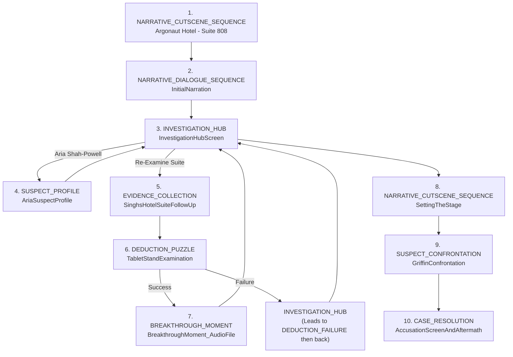

---INSTRUCTIONS---
// --- Hardboiled Thriller Directives ---
// Your mission is to generate a player journey for a Mickey Spillane-style hardboiled thriller.
// Key elements to incorporate:
// 1.  **Visceral, Violent Opening:** The story must kick off with a shocking event that grabs immediate attention.
// 2.  **First-Person Narration (via Detective-ADA Texts):** The player IS the detective. Their observations, thoughts, and the hardboiled "voice" are conveyed through text messages they send to their partner, Assistant District Attorney (ADA) Song. ADA acts as a sounding board, reacting to the player's input, sometimes offering insights or prompts, but the *player* makes the crucial observations.
// 3.  **Punchy Descriptions:** Characters and settings should be described with short, sharp, impactful language.
// 4.  **Economical Prose:** Use short, declarative sentences. Drive the narrative forward with pace.
// 5.  **Personal Focus:** Emphasize the raw, personal elements of the crime – jealousy, betrayal, passion, revenge – over dry procedural details.
// 6.  **Sexual Tension & Loaded Language:** Weave in palpable tension and suggestive dialogue, especially with femme fatales or morally ambiguous characters.
// 7.  **Implicit Clues:** "Evidence" is discovered as sensory observations (e.g., "The air hung heavy with cheap perfume and stale cigarettes," "Heard a faint click from the other room," "Saw a tremor in her hand as she lit a cigarette"). The player texts these observations to ADA, who might comment on their potential significance. Avoid explicit statements like "Found the murder weapon."
// 8.  **Climactic Confrontation:** All key suspects should be present for a final, tense showdown.
// 9.  **Twist Revelation & Decisive Resolution:** The true killer and motive should be a surprise, followed by a swift, definitive end.
// 10. **ADA's Role:** ADA Song is the player's partner. She witnesses the case unfold *through the player's text messages*. Her replies should feel like she's processing the information in real-time alongside the player, occasionally asking clarifying questions or highlighting something the player mentioned. The player's texts *are* the hardboiled narration.

// --- Constants and Rules ---
DEFINE MAX_INITIAL_OBSERVATIONS = 3; // Raw sensory details at the start
DEFINE MAX_INITIAL_SUSPECTS = 3; // Keep the cast tight
DEFINE LOCKED_ITEM_COUNT = 1; // A key item the player needs to figure out how to access (e.g., a locked diary, a hidden compartment)
DEFINE CORE_INTERACTION_MECHANIC = "ObserveAndReport"; // Player makes an observation, texts it to ADA, ADA reacts.

// --- NEW VISUALIZATION REQUIREMENT ---
// After listing all numbered gameplay steps, **append** a Mermaid flowchart that visualizes the navigation between steps.
// Guidelines for the graph:
// 1. Use Mermaid graph TD syntax.
// 2. Represent each step as `S[stepNumber\nScreenName]` (e.g., S1["1. CRIME_SCENE_ARRIVAL"]) to keep nodes compact.
// 3. Draw directed edges that reflect the primary `NAVIGATE` actions between steps (e.g., hub to branch and branch back to hub).
// 4. Include at least the core hub connections and any explicit branching paths shown in OPTIONS.
// 5. Place this graph **after** the final CASE_RESOLUTION step, separated by an empty line.
// 6. Do **not** wrap the Mermaid code block in additional Markdown headings; just start with ```mermaid.
// 7. Keep the graph readable – if more than 15 nodes, consider clustering branches (e.g., subgraph Phase 2).
// This visualization helps designers quickly verify flow coherence.
// --- END VISUALIZATION REQUIREMENT ---

// --- Phenotype Mapping (Hardboiled Adaptation) ---
DEFINE PHENOTYPE_SEQUENCE = [
    // Phase 1: The Gutter Opens Up
    { Phase: 1, Phenotype: "VISCERAL_OPENING_CUTSCENE", Purpose: "Shocking, violent crime scene reveal. Establishes the brutal stakes and dark tone. Player texts initial raw observations to ADA." },
    { Phase: 1, Phenotype: "HARDboiled_NARRATION_NODE", Purpose: "Player, as detective, texts a gritty internal monologue/summary of the scene to ADA, setting the hardboiled voice." },

    // Phase 2: First Contacts & Rising Tension
    { Phase: 2, Phenotype: "OBSERVATION_NODE", Purpose: "Player makes key sensory observations at a new location or about a new character, texts them to ADA. ADA's reply might highlight something." },
    { Phase: 2, Phenotype: "SUSPECT_ENCOUNTER_NODE", Purpose: "First tense interaction with a key suspect (e.g., the dame, the heavy). Loaded dialogue. Player texts impressions/quotes to ADA." },

    // Phase 3: Twisting Loyalties & Hidden Motives
    { Phase: 3, Phenotype: "LOADED_CONVERSATION_NODE", Purpose: "A conversation heavy with subtext, sexual tension, or veiled threats. Player texts key lines and their gut feelings to ADA." },
    { Phase: 3, Phenotype: "IMPLICIT_CLUE_DISCOVERY_NODE", Purpose: "Player stumbles upon a critical object or detail (not explicitly 'evidence'). Texts description to ADA. Its meaning is not immediately clear." },
    { Phase: 3, Phenotype: "BETRAYAL_HINT_CUTSCENE", Purpose: "A brief scene (could be observed by player or a flashback) suggesting a hidden relationship or double-cross, deepening the intrigue. Player texts reaction to ADA." },

    // Phase 4: The Long Drop
    { Phase: 4, Phenotype: "CONFRONTATION_NODE", Purpose: "Player presses a suspect based on earlier observations/ADA's prompts. Suspect gets defensive or reveals something under pressure. Player texts key exchanges to ADA." },
    { Phase: 4, Phenotype: "TWIST_REVEAL_NODE", Purpose: "A critical piece of information or an event that upends the player's current theory. Could be a sudden confession to a lesser crime, or a new, shocking observation. Player texts astonished reaction to ADA." },

    // Phase 5: The Squeeze & The Spill
    { Phase: 5, Phenotype: "ALL_SUSPECTS_GATHER_CUTSCENE", Purpose: "A tense setup where all key players are brought together (e.g., a dimly lit room, a secluded place). Player texts the atmosphere to ADA." },
    { Phase: 5, Phenotype: "CLIMACTIC_CONFRONTATION_NODE", Purpose: "Player, guided by their observations and ADA's feedback, lays out the connections, provoking reactions. The killer's facade crumbles." },
    { Phase: 5, Phenotype: "HARDboiled_RESOLUTION_NODE", Purpose: "The killer is revealed, swift justice (or a cynical equivalent) is delivered. Player texts the stark outcome to ADA. Brief, punchy character epilogues." }
];

// --- Available Gameplay Phenotype Summaries (Hardboiled Adaptation) ---
// Use these phenotypes as building blocks for the gameplay outline. Player's first-person hardboiled narration is primarily via texts to ADA.

// - VISCERAL_OPENING_CUTSCENE: Cinematic depiction of the initial shocking event. Player's first text to ADA is their raw, immediate observation.
// - HARDboiled_NARRATION_NODE: Player texts a hardboiled internal monologue or summary of their thoughts/the situation to ADA. ADA might reply with a question or a supportive comment.
// - INVESTIGATION_HUB_NODE: A central point (e.g., detective's grimy office, a specific bar) where player texts ADA to decide next steps or review "hunches" (implicit clues).
// - OBSERVATION_NODE: Player explores a location, texts specific sensory details (sights, sounds, smells, textures) to ADA. ADA's reply can help player focus.
// - SUSPECT_ENCOUNTER_NODE: Player has a direct, tense interaction with a suspect. Focus on body language, loaded dialogue. Player texts key quotes or observations about their demeanor to ADA.
// - LOADED_CONVERSATION_NODE: Dialogue sequence heavy with subtext, lies, or manipulation. Often involves a femme fatale or a slippery character. Player texts particularly charged lines or their interpretation to ADA.
// - IMPLICIT_CLUE_DISCOVERY_NODE: Player texts ADA about a peculiar item, a strange detail, or something out of place. Its importance isn't immediately obvious.
// - LOCKED_ITEM_PUZZLE_NODE: Player texts ADA about a locked object (diary, safe, etc.) and then has to figure out how to open it based on previous observations.
// - BETRAYAL_HINT_CUTSCENE: A short, impactful scene hinting at a double-cross or hidden connection. Player texts their shocked reaction/new suspicion to ADA.
// - CONFRONTATION_NODE: Player texts ADA their intention to confront someone, then the scene plays out. Player texts key parts of the tense exchange and the suspect's reactions to ADA.
// - TWIST_REVEAL_NODE: A shocking new observation or event. Player texts their disbelief/revelation to ADA.
// - ALL_SUSPECTS_GATHER_CUTSCENE: Sets the stage for the final confrontation. Player texts ADA about the tense atmosphere.
// - CLIMACTIC_CONFRONTATION_NODE: The final accusation. Player texts their reasoning to ADA, who acts as a final check before the player commits. The killer breaks.
// - HARDboiled_RESOLUTION_NODE: The aftermath. Short, punchy summary of fates. Player sends a final, cynical or weary text to ADA.

// --- Data Structures (Conceptual for Hardboiled) ---
TYPE Observation = { Text: TEXT, SensoryDetail: TEXT }; // e.g., Text: "Her perfume hit me like a fist - cheap and desperate.", SensoryDetail: "Smell of jasmine and stale tobacco."
TYPE SuspectProfile = { Name: TEXT, Description: TEXT, // Punchy, hardboiled description
                        MotiveHunch: TEXT, // Detective's initial gut feeling
                        DialogueStyle: TEXT, // e.g., "Talks like a machine gun," "Voice like silk hiding a razor."
                        KeyLines: ARRAY<TEXT> // Loaded lines from encounters
                      };
TYPE GameplayStep = {
    Phase: INTEGER,
    StepNumber: INTEGER,
    PhenotypeTag: TEXT, // MUST be from the Hardboiled Adaptation list
    Screen: TEXT, // e.g., "Crime Scene: Lamplight Alley", "ADA Text Interface", "Suspect: Vera's Apartment"
    DECISION: TEXT, // The player-detective's internal thought or what they need to decide to text ADA.
    DATA: ANY, // Contextual info: raw observations, character descriptions, ADA's last text.
    OPTIONS: ARRAY<{ // Choices for the player-detective, often what to text ADA or what action to take.
        ChoiceLabel: TEXT, // What the player chooses to do/text
        Risk: TEXT, // e.g., "Might spook her," "Could be a dead end."
        Reward: TEXT // e.g., "She might slip up," "Get a clearer picture."
    }>,
    ACTION: TEXT // Pseudocode: `TEXT_ADA("My observation/decision")`, `NAVIGATE TO X`, `SET hunch_X=true`
};

// --- Procedures (Hardboiled Adaptation) ---

PROCEDURE GenerateHardboiledOutline(Synopsis, Characters, Events) RETURNS ARRAY<GameplayStep>
{
    // Overall orchestrator for the hardboiled player journey.

    // 1. Extract Hardboiled Elements:
    VictimData = EXTRACT_VICTIM_DETAILS(Characters); // Who bought it, how?
    FemmeFatale = IDENTIFY_FEMME_FATALE(Characters); // If one exists
    TheHeavy = IDENTIFY_THE_HEAVY(Characters); // If one exists
    KeySuspects = IDENTIFY_KEY_SUSPECTS(Characters, VictimData); // Max 3
    InitialObservations = GENERATE_INITIAL_SCENE_OBSERVATIONS(Synopsis, VictimData); // Visceral details
    CoreMotives = ["Jealousy", "Greed", "Revenge", "Betrayal", "Passion"]; // Standard hardboiled fuel

    GameplaySteps = [];
    CurrentStepNumber = 0;
    PlayerObservationsLog = []; // Log of what player has texted ADA

    // --- Phase 1: The Gutter Opens Up ---

    // Step 1: VISCERAL_OPENING_CUTSCENE
    OpeningSceneDetails = CREATE_OPENING_SHOCK_SCENE(Synopsis, VictimData);
    GameplaySteps.Add(ADD_STEP(
        Phase: 1,
        StepNumber: ++CurrentStepNumber,
        PhenotypeTag: "VISCERAL_OPENING_CUTSCENE",
        Screen: "Crime Scene: " + OpeningSceneDetails.LocationName,
        DECISION: "The scene hits you. What's the first raw detail you send to ADA Song?",
        DATA: {
            SceneVisuals: OpeningSceneDetails.Visuals, // e.g., "Rain-slicked alley, body sprawled like a broken doll."
            SoundCues: OpeningSceneDetails.Sounds, // e.g., "Distant siren, her own ragged breathing."
            InitialPlayerObservationPrompts: InitialObservations // Array of 2-3 punchy observation choices
        },
        OPTIONS: InitialObservations.map(obs => ({ ChoiceLabel: obs.Text, Risk: "Might be a red herring detail", Reward: "Sets the initial tone for ADA" })),
        ACTION: "TEXT_ADA(<choice.Text>); ADD_OBSERVATION_TO_LOG(<choice.Text>); NAVIGATE TO HARDboiled_NARRATION_NODE"
    ));

    // Step 2: HARDboiled_NARRATION_NODE
    FirstNarrationOptions = GENERATE_HARDboiled_OPENING_MONOLOGUES(VictimData, OpeningSceneDetails);
    GameplaySteps.Add(ADD_STEP(
        Phase: 1,
        StepNumber: ++CurrentStepNumber,
        PhenotypeTag: "HARDboiled_NARRATION_NODE",
        Screen: "ADA Text Interface",
        DECISION: "Sum up this mess for ADA. Your gut take.",
        DATA: {
            ADALastReply: "ADA: Just got your text. Sounds grim. What's the full picture?",
            NarrationPrompts: FirstNarrationOptions // Array of 2-3 hardboiled summary options
        },
        OPTIONS: FirstNarrationOptions.map(nar => ({ ChoiceLabel: nar.Monologue, Risk: "Too cynical?", Reward: "Establishes your voice." })),
        ACTION: "TEXT_ADA(<choice.Monologue>); ADD_OBSERVATION_TO_LOG(<choice.Monologue>); SET SceneEstablished=true; NAVIGATE TO INVESTIGATION_HUB_NODE"
    ));

    // --- Phase 2: First Contacts & Rising Tension ---
    // Conceptual: Hub allows choosing to visit a location or a person.
    // Each choice leads to an OBSERVATION_NODE (for location) or SUSPECT_ENCOUNTER_NODE (for person).

    // Example Hub Structure (Simplified)
    GameplaySteps.Add(ADD_STEP(
        Phase: 2,
        StepNumber: ++CurrentStepNumber,
        PhenotypeTag: "INVESTIGATION_HUB_NODE",
        Screen: "Detective's Office / ADA Text Interface",
        DECISION: "The city's full of rats. Which hole do you poke first?",
        DATA: {
            ADALastReply: "ADA: Okay, I'm following. What's your next move on this?",
            AvailableLeads: [
                { Name: "Victim's Apartment", Target: "VictimAptObservationNode", Type: "Location" },
                { Name: "The Dame (Vera)", Target: "VeraEncounterNode", Type: "Person" },
                { Name: "The Muscle (Bruno)", Target: "BrunoEncounterNode", Type: "Person" }
            ]
        },
        OPTIONS: [
            { ChoiceLabel: "Head to the victim's place. See what whispers in the walls.", Risk: "Might be cleaned out.", Reward: "Personal effects always tell a story." },
            { ChoiceLabel: "Time to talk to Vera. She looked like she knew more than she was saying.", Risk: "She'll lie through her teeth.", Reward: "Might catch a glimpse behind the mask." },
            { ChoiceLabel: "Bruno. He had eyes like a cornered wolf. Worth a squeeze.", Risk: "He's not the talking type.", Reward: "Sometimes muscle knows what the brain forgets." }
        ],
        ACTION: "NAVIGATE TO <GET_TARGET_FROM_CHOICE(choice)>" // Logic to map choice to target node
    ));


    // Example OBSERVATION_NODE (Victim's Apartment)
    VictimAptObservations = GENERATE_APT_OBSERVATIONS(VictimData); // Generate punchy, implicit clues
    GameplaySteps.Add(ADD_STEP(
        Phase: 2,
        StepNumber: ++CurrentStepNumber, // Assume this is dynamically assigned
        PhenotypeTag: "OBSERVATION_NODE",
        Screen: "Victim's Apartment",
        DECISION: "The air in here is thick with stale secrets. What detail catches your eye first to text to ADA?",
        DATA: {
            SceneDescription: "Dust motes dancing in the single shaft of light. Smells of old bourbon and regret.",
            ObservationPrompts: VictimAptObservations // e.g., ["A half-packed suitcase under the bed.", "A framed photo, cracked.", "An overflowing ashtray."]
        },
        OPTIONS: VictimAptObservations.map(obs => ({ ChoiceLabel: obs.Text, Risk: "Could be nothing.", Reward: "Another piece of the puzzle for ADA." })),
        ACTION: "TEXT_ADA(<choice.Text>); ADD_OBSERVATION_TO_LOG(<choice.Text>); NAVIGATE TO INVESTIGATION_HUB_NODE"
    ));
    
    // Example SUSPECT_ENCOUNTER_NODE (Vera)
    VeraEncounterDetails = GENERATE_FEMME_FATALE_ENCOUNTER(FemmeFatale);
    GameplaySteps.Add(ADD_STEP(
        Phase: 2,
        StepNumber: ++CurrentStepNumber, // Assume this is dynamically assigned
        PhenotypeTag: "SUSPECT_ENCOUNTER_NODE",
        Screen: "Vera's Boudoir",
        DECISION: "She's playing a game. What part of her act do you report to ADA?",
        DATA: {
            CharacterDescription: VeraEncounterDetails.Description, // "She was poured into that dress like poison into a glass."
            KeyDialogueExchanges: VeraEncounterDetails.Dialogue, // Snippets of loaded conversation
            ObservationPrompts: VeraEncounterDetails.BehavioralObservations // e.g., ["Her eyes flickered to the door when I mentioned Leo.", "She kept twisting that ring on her finger."]
        },
        OPTIONS: VeraEncounterDetails.BehavioralObservations.map(obs => ({ ChoiceLabel: obs.Text, Risk: "Just nerves?", Reward: "ADA might see a pattern." })),
        ACTION: "TEXT_ADA(<choice.Text>); ADD_OBSERVATION_TO_LOG(<choice.Text>); NAVIGATE TO INVESTIGATION_HUB_NODE"
    ));


    // --- Phase 3: Twisting Loyalties & Hidden Motives ---
    // This phase would include LOADED_CONVERSATION_NODE, IMPLICIT_CLUE_DISCOVERY_NODE, BETRAYAL_HINT_CUTSCENE.
    // Each step involves the player texting observations/dialogue to ADA.

    // Example IMPLICIT_CLUE_DISCOVERY_NODE
    HiddenClueDetails = GENERATE_IMPLICIT_CLUE_DATA(); // e.g., A matchbook from an unexpected place, a coded note.
    GameplaySteps.Add(ADD_STEP(
        Phase: 3,
        StepNumber: ++CurrentStepNumber,
        PhenotypeTag: "IMPLICIT_CLUE_DISCOVERY_NODE",
        Screen: "Unexpected Location / ADA Text Interface",
        DECISION: "This... this doesn't fit. What do you tell ADA about it?",
        DATA: {
            DiscoveryContext: HiddenClueDetails.Context, // "Found this tucked in the dead man's coat lining."
            ObjectDescription: HiddenClueDetails.Description, // "A cheap matchbook. 'The Blue Moon Club'. Never heard of it."
            ADALastReply: "ADA: Keep your eyes peeled. Small things can break a case wide open."
        },
        OPTIONS: [
            { ChoiceLabel: "Text ADA: 'Found a matchbook. The Blue Moon Club. Mean anything to you?'", Risk: "Might be a wild goose chase.", Reward: "ADA has good city contacts." },
            { ChoiceLabel: "Text ADA: 'Something odd here. A matchbook from a dive bar. Doesn't feel like his style.'", Risk: "Just a stray item?", Reward: "Reinforces your gut feeling to ADA." }
        ],
        ACTION: "TEXT_ADA(<choice.Text>); ADD_OBSERVATION_TO_LOG(<choice.Text>); SET Clue_BlueMoonMatchbook=true; NAVIGATE TO INVESTIGATION_HUB_NODE"
    ));


    // --- Phase 4: The Long Drop ---
    // CONFRONTATION_NODE, TWIST_REVEAL_NODE. Player texts key moments to ADA.

    // Example CONFRONTATION_NODE (Confronting Vera with matchbook info)
    ConfrontVeraDetails = GENERATE_CONFRONTATION_DATA(FemmeFatale, "BlueMoonMatchbook");
    GameplaySteps.Add(ADD_STEP(
        Phase: 4,
        StepNumber: ++CurrentStepNumber,
        PhenotypeTag: "CONFRONTATION_NODE",
        Screen: "Vera's Apartment / ADA Text Interface",
        DECISION: "Time to see if Vera cracks. How do you tell ADA you're playing this confrontation?",
        DATA: {
            ConfrontationSetup: "Vera looks surprised to see me again. Or maybe just annoyed.",
            ADALastReply: "ADA: The Blue Moon? That's interesting. Tread carefully with her.",
            KeyDialogueOptions: ConfrontVeraDetails.PlayerLines // e.g., ["'Ever been to The Blue Moon, Vera?'", "'Funny, found this in Leo's pocket.' (Show matchbook)"]
        },
        OPTIONS: ConfrontVeraDetails.PlayerLines.map(line => ({ ChoiceLabel: "Text ADA: 'About to hit Vera with this Blue Moon angle. Stand by.' Then say: " + line, Risk: "She might clam up.", Reward: "Could force a reaction." })),
        ACTION: "TEXT_ADA('Starting confrontation with Vera re: Blue Moon.'); SET VeraConfronted_BlueMoon=true; TRIGGER VeraReactionScene(<GET_REACTION_SCENE_ID(choice)>); NAVIGATE TO INVESTIGATION_HUB_NODE_OR_TWIST_REVEAL" // Reaction scene would involve more texts to ADA
    ));

    // --- Phase 5: The Squeeze & The Spill ---
    // ALL_SUSPECTS_GATHER_CUTSCENE, CLIMACTIC_CONFRONTATION_NODE, HARDboiled_RESOLUTION_NODE.

    // Example CLIMACTIC_CONFRONTATION_NODE
    FinalConfrontationSetup = GATHER_ALL_SUSPECTS_DETAILS(KeySuspects);
    GameplaySteps.Add(ADD_STEP(
        Phase: 5,
        StepNumber: ++CurrentStepNumber,
        PhenotypeTag: "CLIMACTIC_CONFRONTATION_NODE",
        Screen: "Dimly Lit Warehouse / ADA Text Interface",
        DECISION: "Everyone's here. The air's thick enough to cut. You've got one shot to lay it out for ADA before you speak. What's the core of your accusation?",
        DATA: {
            SceneAtmosphere: FinalConfrontationSetup.Atmosphere, // "Warehouse reeks of stale beer and fear. Bruno's sweating. Vera's too calm. The other one, Max, looks ready to bolt."
            ADALastReply: "ADA: I'm with you. Lay it out. Who is it, and why?",
            PlayerAccusationPrompts: GENERATE_ACCUSATION_OPTIONS(KeySuspects, PlayerObservationsLog) // Options summarizing different theories based on collected observations.
        },
        OPTIONS: [ /* Options like: "Text ADA: It was Vera. The jealousy was eating her alive. The matchbook was the key." */ ],
        ACTION: "TEXT_ADA(<ACCUSATION_SUMMARY_CHOICE>); TRIGGER KillerBreakdownScene(<GET_KILLER_FROM_CHOICE(choice)>); NAVIGATE TO HARDboiled_RESOLUTION_NODE"
    ));
    
    // Step Final: HARDboiled_RESOLUTION_NODE
    ResolutionDetails = GENERATE_HARDboiled_RESOLUTION_TEXT(CulpritData, KeySuspects);
    GameplaySteps.Add(ADD_STEP(
        Phase: 5,
        StepNumber: ++CurrentStepNumber,
        PhenotypeTag: "HARDboiled_RESOLUTION_NODE",
        Screen: "ADA Text Interface / Epilogue Snippets",
        DECISION: "It's over. How do you sign off with ADA?",
        DATA: {
            CaseOutcomeSummary: ResolutionDetails.Outcome, // "Vera confessed. Claimed Leo was leaving her for another woman. Bruno clammed up, lawyer already on the way."
            CharacterFates: ResolutionDetails.Fates, // Short, punchy updates on each character.
            ADALastReply: "ADA: Hell of a case. You nailed it. Get some rest."
        },
        OPTIONS: [
            { ChoiceLabel: "Text ADA: 'Another one for the books. City's still rotten.'", Risk: null, Reward: null },
            { ChoiceLabel: "Text ADA: 'Justice, or something like it. Time for a drink.'", Risk: null, Reward: null }
        ],
        ACTION: "TEXT_ADA(<choice.Text>); END_CASE"
    ));

    RETURN GameplaySteps;
}

// Helper procedures (Conceptual for Hardboiled - to be defined)
PROCEDURE ADD_STEP(...) RETURNS GameplayStep { /* ... */ }
PROCEDURE EXTRACT_VICTIM_DETAILS(Characters) { /* ... */ }
PROCEDURE IDENTIFY_FEMME_FATALE(Characters) { /* ... */ }
PROCEDURE IDENTIFY_THE_HEAVY(Characters) { /* ... */ }
PROCEDURE IDENTIFY_KEY_SUSPECTS(Characters, VictimData) { /* ... */ }
PROCEDURE GENERATE_INITIAL_SCENE_OBSERVATIONS(Synopsis, VictimData) { /* Returns array of Observation {Text, SensoryDetail} */ }
PROCEDURE CREATE_OPENING_SHOCK_SCENE(Synopsis, VictimData) { /* Returns {LocationName, Visuals, Sounds} */ }
PROCEDURE GENERATE_HARDboiled_OPENING_MONOLOGUES(VictimData, SceneDetails) { /* Returns array of {Monologue} options */ }
PROCEDURE GET_TARGET_FROM_CHOICE(ChoiceLabel) { /* Maps hub choice to target node ID */ }
PROCEDURE GENERATE_APT_OBSERVATIONS(VictimData) { /* Returns array of Observation texts */ }
PROCEDURE GENERATE_FEMME_FATALE_ENCOUNTER(FemmeFatale) { /* Returns {Description, Dialogue snippets, BehavioralObservation texts} */ }
PROCEDURE GENERATE_IMPLICIT_CLUE_DATA() { /* Returns {Context, Description} for a non-obvious clue */ }
PROCEDURE GENERATE_CONFRONTATION_DATA(Suspect, TriggerClueID) { /* Returns {PlayerLines options} */ }
PROCEDURE TRIGGER_VERA_REACTION_SCENE(SceneID) { /* This would be a sub-flow of texts to/from ADA */ }
PROCEDURE GATHER_ALL_SUSPECTS_DETAILS(KeySuspects) { /* Returns {Atmosphere description} */ }
PROCEDURE GENERATE_ACCUSATION_OPTIONS(KeySuspects, PlayerObservationsLog) { /* Player summarizes their case against one suspect to ADA */ }
PROCEDURE TRIGGER_KILLER_BREAKDOWN_SCENE(KillerName) { /* Sub-flow of killer's confession, texted by player to ADA */ }
PROCEDURE GENERATE_HARDboiled_RESOLUTION_TEXT(Culprit, OtherSuspects) { /* Returns {Outcome summary, CharacterFates snippets} */ }
// ... any other necessary hardboiled-specific helpers ...

---/INSTRUCTIONS--- 

---EXAMPLE---

```markdown
**Case:** Viral Echoes (Hardboiled - Standard Phenotypes)
**Goal:** Player, as a cynical detective, texts observations to their partner ADA Song, uncovering Julian Griffin as Raj Singh's killer. The journey emphasizes atmosphere, loaded interactions, and implicit clues, now mapped to standard phenotypes.

**(Phase 1: The Gutter Opens Up)**

1.  **NARRATIVE_CUTSCENE_SEQUENCE: Argonaut Hotel - Suite 808 - The Discovery**
    *   **DECISION:** The scene's a gut punch. What hits you first to text to ADA Song?
    *   **DATA:**
        - SceneDescription: "(Cinematic Cutscene) Cheap hotel art askew. A spilled drink, dark like old blood on the threadbare carpet. Raj Singh, face down, one hand clutching a useless tablet. Air thick with the smell of fear and stale cigar smoke. Distant city wail. The damn buzzing of a neon sign outside the grimy window."
        - InitialPlayerObservationPrompts: ["Smells like Singh played host to a cheap cigar and an expensive ghost.", "Tablet still clutched in his hand. Dead man's switch or just bad luck?", "Door wasn't forced. Whoever did this, Singh let 'em in or they had a key."]
    *   **OPTIONS:**
        - Text ADA: "Suite 808. Singh's bought the farm. Smells like cheap cigars and a ghost with expensive taste." (Risk: "Too flippant?", Reward: "Sets the tone with ADA.")
        - Text ADA: "Argonaut. Singh's on the floor, clutching a tablet. Looks like he knew his killer." (Risk: "Jumping to conclusions?", Reward: "Highlights a key detail for ADA.")
        - Text ADA: "No forced entry at Singh's suite. This was personal or professional, close up." (Risk: "Stating the obvious?", Reward: "Focuses ADA on entry method.")
    *   **ACTION:** `TEXT_ADA(<choice.Text>); ADD_OBSERVATION_TO_LOG(<choice.Text>); NAVIGATE TO InitialNarration`

2.  **NARRATIVE_DIALOGUE_SEQUENCE: InitialNarration - Giving ADA the Lowdown**
    *   **DECISION:** Sum up this mess for ADA. Your gut take.
    *   **DATA:**
        - SpeakingCharacter: "Player (Detective - via text to ADA)"
        - DialogueContent: ["This wasn't a robbery. Too clean, too quiet. Someone wanted Singh silenced, not his wallet.", "The way he's sprawled, he never saw it coming. Or he saw it and didn't believe it.", "Tech money, political heat, rivals snapping at his heels. This town's full of reasons to kill a guy like Singh."] // These are options for player to text
        - ADALastReply: "ADA: Got it. Argonaut. Singh. What's the air taste like in there, detective?"
    *   **OPTIONS:**
        - Text ADA: "Too clean for a robbery, Song. This was a message, writ in .38 caliber." (Risk: "Assuming weapon type.", Reward: "Strong opening assessment for ADA.")
        - Text ADA: "He looks surprised. Maybe the killer was someone he trusted. Or someone he underestimated." (Risk: "Pure speculation.", Reward: "Plants seed of betrayal for ADA.")
        - Text ADA: "This has all the hallmarks of a professional hit, but with a personal stench I can't shake." (Risk: "Contradictory?", Reward: "Conveys complexity to ADA.")
    *   **ACTION:** `TEXT_ADA(<choice.Monologue>); ADD_OBSERVATION_TO_LOG(<choice.Monologue>); SET SceneEstablished=true; NAVIGATE TO InvestigationHubScreen`

**(Phase 2: First Contacts & Rising Tension)**

3.  **INVESTIGATION_HUB: InvestigationHubScreen - Detective's Office**
    *   **DECISION:** The rain's stopped, but the city still stinks of secrets. Who's next on your dance card? (Player decides what to text ADA about their next move).
    *   **CLUES/DATA:**
        - CaseSummary: "Victim: Raj Singh, Argonaut Hotel. Observations: No forced entry, tablet clutched in hand. Gut feeling: Professional hit with personal undertones. ADA Song is waiting for your next move."
        - Activities: [
            { Name: "Examine Singh's Office - GenMat HQ (Remote Access)", TargetScreen: "GenMatOfficeEvidenceCollection", Phenotype: "EVIDENCE_COLLECTION" },
            { Name: "Talk to Aria Shah-Powell - City Supervisor", TargetScreen: "AriaSuspectProfile", Phenotype: "SUSPECT_PROFILE" },
            { Name: "Lean on Jack Sullivan - Fired Engineer", TargetScreen: "JackSuspectProfile", Phenotype: "SUSPECT_PROFILE" },
            { Name: "Press Lynn Nguyen - The Reporter", TargetScreen: "LynnSuspectProfile", Phenotype: "SUSPECT_PROFILE" }
            ]
    *   **OPTIONS:**
        - Text ADA: "Let's see what digital ghosts are rattling around Singh's company, GenMat. Give their tech guys a nudge." (Risk: "Might tip our hand.", Reward: "Digital footprints don't lie often.")
        - Text ADA: "Supervisor Shah-Powell. Mixed up with Singh on some city deal. Time to see if she's singing any sad songs." (Risk: "Politicians are slippery.", Reward: "Gauge political heat.")
        - Text ADA: "That fired engineer, Sullivan. Had an axe to grind. Maybe he buried it in Singh." (Risk: "Too obvious?", Reward: "Check disgruntled employee angle.")
        - Text ADA: "The dame reporter, Nguyen. Singh was feeding her something. Maybe she knows what choked him." (Risk: "She'll clam up.", Reward: "Reporters always know more.")
    *   **ACTION:** `TEXT_ADA("My next move: " + <choice.LeadName>); NAVIGATE TO <GET_TARGET_SCREEN_FROM_CHOICE(choice)>`

4.  **SUSPECT_PROFILE: AriaSuspectProfile - Supervisor Shah-Powell**
    *   **DECISION:** Shah-Powell. All power suits and practiced smiles. What observation about her demeanor or statement do you text to ADA?
    *   **CLUES/DATA:**
        - SuspectInfo: "Aria Shah-Powell. SF Supervisor. Reportedly argued with Singh over political fallout from his 'fireworks' incident. Claims her concern was 'purely for the city's image'. Dressed like a million bucks, if a million bucks was trying too hard. Her smile didn't reach her eyes; they were calculating, cold as a banker's heart."
        - Statements: ["ASP: 'Raj's... incident... was a PR nightmare. My concern was purely for the city's image, detective.'", "ASP: 'His erratic behavior was becoming a liability. But murder? Preposterous.'"]
        - BehavioralObservationPrompts: ["She kept fiddling with an expensive pen. Nervous habit or showing off?", "When I mentioned Singh's 'rivals', her eyes flickered. Just a fraction.", "Her handshake was firm, but her palm was damp."]
    *   **OPTIONS:**
        - Text ADA: "Shah-Powell: all smooth talk, but eyes darted at 'rivals'. Noted." (Risk: "Might be nothing.", Reward: "Highlights subtle tell for ADA.")
        - Text ADA: "Supervisor claims 'political fallout'. Smelled like BS, grade A." (Risk: "Too blunt?", Reward: "Gives ADA your gut read.")
        - Text ADA: "Aria's hands were clammy. For a woman in control, she's sweating this one." (Risk: "Bad coffee?", Reward: "Focuses ADA on nervousness.")
    *   **ACTION:** `TEXT_ADA(<choice.Text>); ADD_OBSERVATION_TO_LOG("Aria: " + <choice.Text>); NAVIGATE TO InvestigationHubScreen`

**(Phase 3: Twisting Loyalties & Hidden Motives)**

5.  **EVIDENCE_COLLECTION: SinghsHotelSuiteFollowUp - Back to the Argonaut**
    *   **DECISION:** Back at Singh's suite. Something felt off. This tablet stand... it's custom, too slick for this dump. What specific observation about it do you text to ADA?
    *   **CLUES/DATA:**
        - SceneDesc: "Went back to Singh's suite. The silence was louder this time. Uniforms missed it, but this tablet stand... it ain't off the shelf. Too clean, too new. Doesn't match the rest of his gear."
        - Hotspots: ["Examine Tablet Stand", "Re-check desk", "Look under bed"]
        - TabletStandDetail: "Custom-made tablet charging stand. Sleek black, no branding. Feels heavier than it looks. Got a weird little seam on the underside."
        - ADALastReply: "ADA: Good call going back. Devil's always in the details. What's this stand telling you?"
    *   **OPTIONS:**
        - Text ADA: "This tablet stand in Singh's room. Custom job. Heavy. Feels like more to it than charging toys." (Risk: "Just high-end tech.", Reward: "Flags suspicious object for ADA.")
        - Text ADA: "Tablet stand. Only new thing in this whole damn suite. Stands out. Why?" (Risk: "Crude.", Reward: "Emphasizes anomalous nature to ADA.")
        - Text ADA: "Found a weird seam on Singh's tablet stand. Like it's meant to be opened. Or hide something." (Risk: "Don't break it.", Reward: "Suggests hidden compartment.")
    *   **ACTION:** `TEXT_ADA(<choice.Text>); ADD_OBSERVATION_TO_LOG("Suspicious tablet stand: " + <choice.Text>); SET PotentialEvidence_TabletStand=true; NAVIGATE TO TabletStandExamination`

6.  **DEDUCTION_PUZZLE: TabletStandExamination - Talking to Tech**
    *   **DECISION:** This stand is definitely more than it seems. Singh was an AI guy. Voice commands? How do you tell ADA you're gonna try and talk to it, and what command feels right?
    *   **CLUES/DATA:**
        - PuzzleContent: "The custom tablet stand is voice-activated. Needs a specific GenMat debug phrase."
        - Item: "Custom Tablet Charging Stand (Suspected Hidden Microphone)"
        - ADALastReply: "ADA: Custom, huh? Singh was deep in AI. Those GenMat guys are all about voice activation. Think it listens? Debug phrases? Master overrides?"
        - Hint: "GenMat engineers often used 'Archive Override' followed by a number for internal projects."
    *   **OPTIONS:**
        - Text ADA & Try Command: "Going to try 'GenMat Archive Override Seven' on this stand. Singh loved talking to his tech." (Risk: "Might do nothing.", Reward: "Could unlock it.")
        - Text ADA & Try Command: "This stand has to be GenMat. Trying 'System Diagnostics Override Five'." (Risk: "Wrong command tree.", Reward: "Systematic approach.")
    *   **ACTION:** `TEXT_ADA(<choice.Text>); ATTEMPT_VOICE_COMMAND(<CommandInChoice>); IF Success: NAVIGATE TO BreakthroughMoment_AudioFile; ELSE: NAVIGATE TO DeductionFailure_TabletStand`

**(Phase 4: The Long Drop)**

7.  **BREAKTHROUGH_MOMENT: BreakthroughMoment_AudioFile - The Stand Sings**
    *   **DECISION:** The recording. Griffin's voice, clear as a bell. The argument, the shots. This is it. How do you break it to ADA?
    *   **CLUES/DATA:**
        - Revelation: "Audio File from Tablet Stand: 'You have proof? You wouldn't dare!' (Julian Griffin's voice). 'It's over, Julian. Everyone will know.' (Raj Singh's voice). Sounds of a struggle, two muffled POPS, then only panicked breathing."
        - ADALastReply: "ADA: Let me know if that thing makes a peep, detective. We need something solid."
    *   **OPTIONS:**
        - Text ADA: "Bingo, Song. The stand coughed it up. Got audio. Griffin and Singh. Argument. Then... gunshots. Clear as day. It was Griffin." (Risk: "None. This is it.", Reward: "Delivers the core breakthrough to ADA.")
        - Text ADA: "You were right, ADA. Voice command worked. The tablet stand was a mic. Recorded everything. Julian Griffin. He killed Singh. I heard it all." (Risk: "Slightly dramatic.", Reward: "Confirms theory, credits ADA, delivers shock.")
    *   **ACTION:** `TEXT_ADA(<choice.Text>); ADD_EVIDENCE_LOG("Audio implicates Julian Griffin."); SET PrimeSuspect_JulianGriffin=true; NAVIGATE TO InvestigationHubScreen`

**(Phase 5: The Squeeze & The Spill)**

8.  **NARRATIVE_CUTSCENE_SEQUENCE: SettingTheStage - Precinct Play**
    *   **DECISION:** Got Griffin, Shah-Powell, Sullivan, Nguyen all stewing in separate rooms. Time to bring Griffin to the main stage. What's the setup you text to ADA?
    *   **DATA:**
        - SceneDescription: "(Omniscient Cutscene showing the precinct buzzing). Griffin is in Interrogation Room 1. Shah-Powell's lawyer is making noise down the hall. Sullivan looks like he's seen a ghost in another room. Nguyen is coolly observing everything from a bench."
        - PlayerDetectiveInternalThought: "Time to put the screws to Griffin."
        - ADALastReply: "ADA: The audio is damning. Griffin's toast. But let's make sure this is buttoned up tight. Your play, detective."
    *   **OPTIONS:**
        - Text ADA: "Bringing Griffin into the main interrogation room. Going to play him the audio. Let's see his face when he hears himself digging his own grave." (Risk: "He might lawyer up instantly.", Reward: "High-pressure tactic.")
        - Text ADA: "Got all the players here. Griffin's up first. I want him to know we have it all before we even start the official recording." (Risk: "Could be seen as coercive.", Reward: "Psychological play.")
    *   **ACTION:** `TEXT_ADA(<choice.Text>); NAVIGATE TO GriffinConfrontation`

9.  **SUSPECT_CONFRONTATION: GriffinConfrontation - The Mask Cracks**
    *   **DECISION:** Griffin heard the tape. His face is a mask of porcelain cracking. One final push. What part of his crumbling facade or your accusation strategy do you text ADA before you go for the kill shot in the room?
    *   **CLUES/DATA:**
        - SuspectBehavior: "Played the tape. Griffin went white. That slick composure of his shattered like cheap glass. He's looking for an exit where there ain't one. Tic in his eye is working overtime."
        - ADALastReply: "ADA: He knows he's caught. Press him on the motive. The corporate espionage. Make him own it."
        - KeyLinesOfAccusation: ["Focus on the stolen code evidence Raj had.", "Focus on the financial ruin Griffin faced.", "Focus on the sheer panic in his voice on the tape when Raj mentioned exposure."]
    *   **OPTIONS:**
        - Text ADA: "He's crumbling. That tic is a giveaway. He knows we got him on the espionage. That was the trigger." (Risk: "Delaying final accusation.", Reward: "Confirms motive alignment with ADA.")
        - Text ADA: "Griffin's trying to stare me down, but his hands are shaking. He's done. Time to formally ask him why murder was a good career move." (Risk: "Direct, aggressive.", Reward: "Signals intent to ADA before ACCUSATION.")
    *   **ACTION:** `TEXT_ADA(<choice.Text>); TRIGGER KillerBreakdownScene("JulianGriffin"); NAVIGATE TO AccusationScreen`

10. **CASE_RESOLUTION: AccusationScreenAndAftermath - The City Still Stinks**
    *   **DECISION:** Griffin spilled. It's a wrap. How do you close this chapter with ADA Song?
    *   **CLUES/DATA:**
        - CulpritConfessionSummary: "Griffin confessed after hearing the audio. Sang about the stolen code, the panic when Raj threatened to expose him, the whole sordid mess. Claimed it was a last resort."
        - CharacterFates: "Shah-Powell will likely spin this to her advantage. Sullivan will probably drink himself into an early grave with relief or bitterness. Nguyen already has the headline for her story about corporate greed."
        - ADALastReply: "ADA: Good work, detective. Another one bites the dust in this charming city. Don't let the grime stick to you too much."
    *   **OPTIONS:**
        - Text ADA: "Just another Tuesday in SF, Song. He's cooling his heels. The rest of 'em are still rats in the maze. What else is new?" (Risk: null, Reward: "Cynical sign-off.")
        - Text ADA: "Griffin's put away. At least there's that. This city chews 'em up and spits 'em out. I need a bourbon, neat." (Risk: null, Reward: "Weary, classic hardboiled ending.")
    *   **ACTION:** `TEXT_ADA(<choice.Text>); SHOW_CASE_OUTCOME(GriffinGuilty_ViralEchoes); END_CASE`
```


---/EXAMPLE---

---SCHEMA---

**Case:** [Case Title derived from Synopsis/Events - Hardboiled Style]
**Goal:** Guide the player, as a hardboiled detective, through a gritty investigation driven by observations texted to their ADA partner. The player must uncover implicit clues, navigate tense encounters, and unmask the killer in a dramatic confrontation, all while maintaining a cynical, first-person narrative voice via texts.

**Output Structure:**
The gameplay outline is a sequence of numbered steps, grouped by phase. Each step represents a player interaction (primarily texting observations/decisions to ADA Song) or a narrative beat, and MUST be tagged with a **Hardboiled Gameplay** `PhenotypeTag`. The sequence forms the player journey. ADA's replies are conceptual and serve to guide the LLM in crafting the player's textual narration and choices.

**PhenotypeTag (Enum):**
The `PhenotypeTag` for each step MUST be one of the following values from the Hardboiled Adaptation:
- `VISCERAL_OPENING_CUTSCENE`
- `HARDboiled_NARRATION_NODE`
- `INVESTIGATION_HUB_NODE`
- `OBSERVATION_NODE`
- `SUSPECT_ENCOUNTER_NODE`
- `LOADED_CONVERSATION_NODE`
- `IMPLICIT_CLUE_DISCOVERY_NODE`
- `LOCKED_ITEM_PUZZLE_NODE`
- `BETRAYAL_HINT_CUTSCENE`
- `CONFRONTATION_NODE`
- `TWIST_REVEAL_NODE`
- `ALL_SUSPECTS_GATHER_CUTSCENE`
- `CLIMACTIC_CONFRONTATION_NODE`
- `HARDboiled_RESOLUTION_NODE`

**(Phase [Phase Number]: [Hardboiled Phase Name])**

[Step Number]. **[PhenotypeTag]: [Step Title - Punchy, Hardboiled Style]**
    *   **DECISION:** [The player-detective's internal thought, dilemma, or what they need to decide to text/do next. This frames the player's hardboiled narration.]
    *   **DATA:** [Key contextual information: descriptions of scenes/characters in hardboiled style, ADA Song's last conceptual text reply, prompts for player observations/dialogue.]
    *   **OPTIONS:** (Each option is a player choice, often what hardboiled observation/statement to text ADA, or what action to take.)
        - [OptionLabel 1 - Player's text/action] (Risk: [Cynical assessment of potential downside]; Reward: [Hardboiled assessment of potential upside])
        - [OptionLabel 2 - Player's text/action] (Risk: [...]; Reward: [...])
        - ... (etc.)
    *   **ACTION:** `[Compact pseudocode: TEXT_ADA("Player's chosen text"); NAVIGATE TO next_node; SET flag=true; ADD_OBSERVATION_TO_LOG("Summary of observation")]`

*... Repeat for all steps across all phases ...*

**Mermaid Visualization Requirement:** After the final numbered `HARDboiled_RESOLUTION_NODE` step, append a Mermaid `graph TD` flow-chart that maps the primary `NAVIGATE` paths between steps, as specified in the main instructions.

---/SCHEMA--- 
